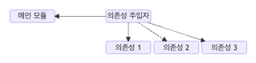
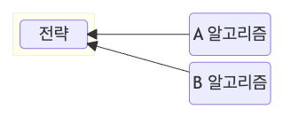
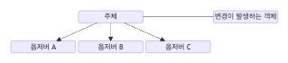
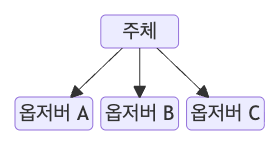
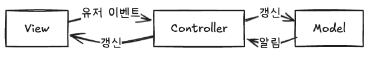
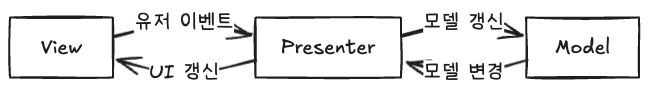
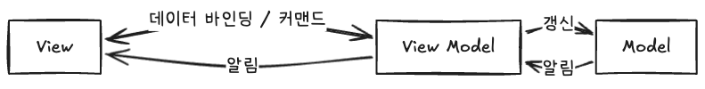

> [스터디](https://commonsite.notion.site/CS-372cc204d2648052884cc97488265e59)를 함께 진행했음

**라이브러리** : 하나의 기능을 모듈화한 것

**프레임워크** : 애플리케이션의 전체 구조와 실행 흐름을 미리 잡아두는 틀

## 1.1.1 싱글톤 패턴 (singleton pattern)

**하나의 인스턴스만 갖는 패턴**

아래 코드 출처 (약간 수정함) : https://github.com/wnghdcjfe/csnote/blob/main/ch1/2.js

```javascript
class Singleton {
  static instance;
  
  constructor() {
    if (!Singleton.instance) {
      Singleton.instance = this;
    }
    return Singleton.instance;
  }
  
  static getInstance() {
    if (!Singleton.instance) {
      Singleton.instance = new Singleton();
    }
    return Singleton.instance;
  }
}

const a = new Singleton()
const b = new Singleton() 
console.log(a === b) // true 
```

- **장점** : 인스턴스의 생성 비용을 아낄 수 있다.
- **단점** : 같은 인스턴스를 사용하는 코드들의 의존성이 높아진다.

이 단점은 특히 TDD에서 걸림돌이 된다. 독립된 테스트를 수행해야 하는데, 같은 인스턴스를 사용하기 때문에 테스트들이 독립이 안 되는 것. ➡️ 이 단점을 해결하기 위한 방법이 **의존성 주입 (Dependency Injection, DI)**이다.

### 의존성 주입

메인 모듈 하나를 두고, 의존성 주입자를 통해서 의존성을 주입하는 패턴



- **장점** : 
  - 모듈 교체가 가능한 구조를 만들 수 있다. 테스트나 마이그레이션이 쉬운 구조를 만들 수 있다.
  - 추상화 레이어를 넣기 때문에 애플리케이션의 의존성 방향이 일관되어진다. → 모듈 간 관계가 명확해진다.
- **단점** : 
  - 복잡성이 높아진다.
  - 레이어가 하나 추가되기 때문에 런타임 패널티가 있을 수 있다.

**의존성 주입 원칙** : 상위 모듈은 하위 모듈에서 어떤 것도 가져오지 말아야 한다.

### 활용

데이터베이스 연결 모듈에 많이 쓰인다. 하나의 DB에 연결한 뒤에는 그 연결을 재사용하는 것이 효율적이기 때문.

- MongoDB 데이터베이스를 연결할 때 쓰는 mongoose 모듈
- MySQL 데이터베이스를 연결할 때

## 1.1.2 팩토리 패턴 (factory pattern)

**객체를 사용하는 코드에서 객체 생성에 대한 부분을 추상화한 패턴**

`LatteFactory` 에서는 주문 정보에 따라서 `Latte` 객체 생성에 필요한 샷 수, 우유 종류, 시럽 종류를 기본값 규칙에 따라서 결정하고 `Latte` 객체를 생성한다. 팩토리를 이용해서 **객체 생성에 필요한 세부 규칙을 실제 사용하는 코드에서 분리**한 것.

아래 코드 출처 (약간 수정함) : https://github.com/wnghdcjfe/csnote/blob/main/ch1/5.js

```javascript
class Latte {
  constructor({ shots, milk, syrup }) {
    this.name = "latte"
    this.shots = shots
    this.milk = milk
    this.syrup = syrup
  }
}

class LatteFactory {
  static createCoffee(order) {
    const shots = order.size === "large" ? 2 : 1
    const milk = order.milk ?? "regular"
    const syrup = order.syrup ?? "none"

    return new Latte({ shots, milk, syrup })
  }
}

const main = () => {
  const order = {
    size: "large",
    milk: "oat",
    syrup: "vanilla",
  }

  const coffee = LatteFactory.createCoffee(order)

  console.log(coffee)
  // Latte {
  //   name: "latte",
  //   shots: 2,
  //   milk: "oat",
  //   syrup: "vanilla"
  // }
}

main()
```

**장점** : 

상위에서는 객체 생성과 관련된 부분을 신경쓰지 않아도 됨 → 서로 의존적이긴 하지만 **느슨한 결합**을 유지할 수 있다.

객체 생성 로직이 따로 떨어져 있기 때문에 리팩토링이 쉬워짐. 유지보수 비용이 낮아진다.

**단점** : 

객체마다 팩토리 클래스를 생성해야 한다. ➡️ **클래스의 개수가 너무 많아진다.**

이 단점을 해결하기 위한 변형 팩토리 패턴 :

- Enum Factory Method 패턴 : enum 상수 안에 추상 메서드를 구현하는 패턴
  ```java
  Shape rectangle = EnumShapeFactory.RECTANGLE.create("red");
  ```
- Dynamic Factory 패턴 : 유형을 동적으로 등록해서 유형에 맞는 객체를 생성할 수 있는 팩토리 클래스를 사용하는 패턴

참고 : 

- [💠 Dynamic Factory 디자인 패턴](https://inpa.tistory.com/entry/GOF-💠-Dynamic-Factory-변형-패턴-알아보기)
- [💠 Enum Factory Method 디자인 패턴](https://inpa.tistory.com/entry/GOF-💠-Enum-Factory-Method-변형-패턴)

### 활용

**기본 값을 설정하거나, 어떤 조건에 따라서 객체를 뚝딱 만들어야 하는 상황**에서 활용할 수 있다. 이런 향기가 날 때.

```javascript
if (type === "a") {
  // A 만들기
} else if (type === "b") {
  // B 만들기
} else if (type === "c") {
  // C 만들기
}
```

- API 클라이언트 생성 : 환경에 따라 다른 baseURL을 설정한 인스턴스를 생성해야 할 때
  ```javascript
  class ApiClientFactory {
    static create(env, token) {
      const baseURL =
        env === "production"
          ? "https://api.example.com"
          : "https://dev-api.example.com"
  
      return axios.create({
        baseURL,
        headers: {
          Authorization: `Bearer ${token}`,
        },
      })
    }
  }
  
  const api = ApiClientFactory.create("production", "access-token")
  
  api.get("/users")
  ```
- 에러 종류에 따른 토스트 생성
  ```javascript
  class ToastFactory {
    static create(errorCode) {
      if (errorCode === "AUTH_EXPIRED") {
        return {
          message: "로그인이 만료됐어요.",
          action: "다시 로그인",
        }
      }
  
      return {
        message: "문제가 발생했어요.",
        action: "닫기",
      }
    }
  }
  
  const toast = ToastFactory.create("AUTH_EXPIRED");
  ```


## 1.1.3 전략 패턴 (strategy pattern)

**객체의 동작을 바꾸고 싶을 때 전략이라고 부르는 캡슐화된 알고리즘을 객체의 컨텍스트 안에서 교체하는 방식.**

내부에서 사용하는 알고리즘을 외부에서 인자로 전달받는 모양을 하고 있다.



Node.js에서 인증 모듈을 구현할 때 사용하는 [passport](https://www.passportjs.org/) 라이브러리가 전략 패턴을 활용하고 있다. `passport.use()` 라는 메서드에 인증에 사용할 전략을 매개변수로 전달해서 인증 로직을 수행하는 방식.

1. username과 password를 이용해 인증할 때 (LocalStrategy)
   ```javascript
   passport.use(new LocalStrategy(
     function(username, password, done) {
       User.findOne({ username: username }, function (err, user) {
         if (err) { return done(err); }
         if (!user) { return done(null, false); }
         if (!user.verifyPassword(password)) { return done(null, false); }
         return done(null, user);
       });
     }
   ));
   ```
2. Google을 이용해 인증할 때
   ```javascript
   passport.use(new GoogleStrategy({
       clientID: GOOGLE_CLIENT_ID,
       clientSecret: GOOGLE_CLIENT_SECRET,
       callbackURL: "http://www.example.com/auth/google/callback"
     },
     function(accessToken, refreshToken, profile, cb) {
       User.findOrCreate({ googleId: profile.id }, function (err, user) {
         return cb(err, user);
       });
     }
   ));
   ```

**장점** : 

- 런타임에 알고리즘을 변경할 수 있다.
  아래 코드 출처 : [💠 전략(Strategy) 패턴 - 완벽 마스터하기](https://inpa.tistory.com/entry/GOF-💠-전략Strategy-패턴-제대로-배워보자#비슷한_디자인_패턴_비교)
  ```java
  // 클라이언트 - 전략 제공/설정
  class User {
      public static void main(String[] args) {
          // 플레이어 손에 무기 착용 전략을 설정
          TakeWeaponStrategy hand = new TakeWeaponStrategy();
  
          // 플레이어가 검을 들도록 전략 설정
          hand.setWeapon(new Sword());
          hand.attack(); // "칼을 휘두르다"
  
          // 플레이어가 방패를 들도록 전략 변경
          hand.setWeapon(new Shield());
          hand.attack(); // "방패로 밀친다"
          
          // 플레이어가 석궁을 들도록 전략 변경
          hand.setWeapon(new Crossbow());
          hand.attack(); // "석궁을 발사하다"
      }
  }
  ```
- 알고리즘을 재사용할 수 있어 코드 중복을 줄일 수 있다.

**단점** : 전략마다 객체를 만들기 때문에 (위의 예시에서 `LocalStrategy`, `GoogleStrategy`) 클래스가 많아져 관리가 어렵고 코드의 복잡성이 높아질 수 있다. 

## 1.1.4 옵저버 패턴 (observer pattern)

**주체가 어떤 객체를 관찰하고 있다가, 변경이 생기면 등록된 옵저버들에게 알리는 패턴**

주체는 관찰 대상과 다를 수도, 같을 수도 있다.

주체와 관찰 대상이 다른 경우 : 



주체와 관찰 대상이 같은 경우 : 



주로 **이벤트 기반 시스템**에서 쓰인다. **MVC 패턴**에도 사용됨.

> 자바에서 상속과 구현의 차이
>
> - 상속 : 일반 클래스, 추상 클래스를 기반으로 구현
> - 구현 : 인터페이스를 기반으로 구현

### 자바스크립트에서의 옵저버 패턴 - 프록시 객체를 활용한

[프록시 객체](https://developer.mozilla.org/en-US/docs/Web/JavaScript/Reference/Global_Objects/Proxy) : 어떤 대상의 기본적인 작업을 가로채서 재정의할 수 있는 객체

2개의 매개변수를 받는다

- `target` : 프록시할 원본 객체
- `handler` : 가로채는 작업과 가로채는 작업을 재정의할 방법을 정의하는 객체

프록시 객체를 이용해서 외부 객체의 변경을 감지해서 등록된 옵저버에게 알리는 구조를 구현해보자.

아래 코드 출처 (약간 수정함) : https://github.com/wnghdcjfe/csnote/blob/main/ch1/10.js

```javascript
function createReactiveObject(target) {
  const observers = [];

  const proxy = new Proxy(target, {
    set(obj, prop, value) {
      if (value !== obj[prop]) {
        const prev = obj[prop];
        obj[prop] = value;

        observers.forEach((observer) => {
          observer(`${prop}가 [${prev}]에서 [${value}]로 변경되었습니다.`);
        });
      }

      return true;
    },
  });

  proxy.subscribe = function (observer) {
    observers.push(observer);
  };

  return proxy;
}

const todo = createReactiveObject({
  title: "옵저버 패턴 정리하기",
  status: "진행 전",
});

todo.subscribe(console.log); // console.log를 todo의 observer로 등록한다.

todo.status = "진행 전";
todo.status = "진행 중";
todo.status = "완료";

// status가 [진행 전]에서 [진행 중]로 변경되었습니다.
// status가 [진행 중]에서 [완료]로 변경되었습니다.
```

### Vue.js 3.0의 옵저버 패턴

Vue에서 ref나 reactive로 정의하면 그 값이 변경되었을 때 뷰가 업데이트된다. 이는 옵저버 패턴으로 구현된 것이다.

- [ref와 reactive를 설명하는 Vue.js 공식문서](https://ko.vuejs.org/guide/essentials/reactivity-fundamentals)
- [책에 인용된 createReactiveObject 함수 내부 구현 코드](https://github.com/vuejs/core/blob/main/packages/reactivity/src/reactive.ts#L268) : 어떤 객체를 관찰 가능한 객체로 만드는 함수
  
  변경이 발생했을 때 해당 객체를 구독하는 옵저버들에게 알리는 역할은 `baseHandlers` 나 `collectionHandlers` 에서 수행하게 된다.

## 1.1.5 프록시 패턴 (proxy pattern)

**대상 객체에 접근하기 전, 그 접근에 대한 흐름을 가로채서 앞단의 인터페이스를 추가하는 패턴**

객체의 속성, 변환을 보완하거나, 보안, 데이터 검증, 캐싱, 로깅에 활용한다. 가장 큰 활용 예시가 프록시 서버이다.

### 프록시 서버

**프록시 서버** : 서버와 클라이언트 사이에 위치하는 서버. 클라이언트가 자신을 통해 네트워크 서비스에 간접적으로 접속하게 한다.

> **프록시 서버의 캐싱** : 최초 요청 시에 프록시 서버에 정보를 담아두고, 이후 요청이 캐시한 정보를 요청하면 원격 서버에 다시 요청하지 않고 캐시한 정보를 이용해 응답하는 것을 말함. 불필요한 요청을 줄일 수 있기 때문에 트래픽이 줄어든다.

1. **nginx** : 주로 Node.js 서버 앞단의 프록시 서버로 활용한다. 
   - 실제 서버의 포트를 숨길 수 있다.
   - 정적 자원을 gzip 압축할 수 있다. => 데이터 전송량을 줄일 수 있다.
   - 익명 사용자의 직접적인 서버로의 접근을 차단. => 보안성을 높인다.
2. **Cloudflare** : CDN 서비스
   - DDoS 방어 : 의심스러운 트래픽, 시스템을 통해서 오는 트래픽을 자동으로 차단해서 보호
   - HTTPS 구축 : Cloudflare가 HTTPS 인증서를 제공하기 때문에 직접 인증서를 설치하지 않고 사용자에게 HTTPS 사이트를 제공할 수 있다. 하지만 Cloudflare와 내 서버 사이 구간은 암호화되지 않기 때문에 느슨한 보안 방식이라는 점을 주의해야 한다.
     ```
     사용자 브라우저 -- HTTPS --> Cloudflare -- HTTP --> 내 서버
     ```

3. **CORS 에러 해결을 위한 프런트엔드의 프록시 서버**
   프런트엔드 개발을 할 때 백엔드 origin과 다른 origin에서 요청을 하게 되기 때문에 CORS 에러가 발생하게 된다.

   백엔드 서버에서 `Access-Control-Allow-Origin` 에 오리진을 추가해주는 방법도 있지만, 추가가 불가능한 경우에는 프런트엔드 서버 앞단에 프록시 서버를 두는 방법도 있다. ([Vite Proxy](https://ko.vite.dev/config/server-options.html#server-proxy) 등....)

   프록시 서버에서 프런트엔드에서 요청되는 오리진을 백엔드의 오리진으로 바꿔서 요청해주면 CORS 에러가 해결된다. 

## 1.1.6 이터레이터 패턴 (iterator pattern)

**이터레이터(iterator)를 이용해서 컬렉션(collection)의 요소들에 접근하는 패턴**

map이든 set이든 array든 자료의 구조와는 관계없이 이터레이터라는 하나의 인터페이스로 접근할 수 있게 하는 것.

> **이터레이터 프로토콜** : 이터러블한 객체들을 순회할 때 쓰이는 규칙 (`for a of b` 같은 것)
>
> 이터러블한 객체 : 반복 가능한 객체

```javascript
const map = new Map([['a', 1], ['b', 2], ['c', 3]]);
const set = new Set(['a', 'b','c']);
const array = [1, 2, 3];

for (const x of map) console.log(x);
// [ 'a', 1 ]
// [ 'b', 2 ]
// [ 'c', 3 ]
for (const x of set) console.log(x);
// a
// b
// c
for (const x of array) console.log(x);
// 1
// 2
// 3
```

## 1.1.7 노출모듈 패턴 (revealing module pattern)

자바스크립트에서 즉시 실행 함수(IIFE)를 이용해서 public, private 같은 접근 제어자를 구현하는 패턴

아래 코드 출처 (약간 수정함) : https://github.com/wnghdcjfe/csnote/blob/main/ch1/12.js

```javascript
const user = (() => {
  let name = "정대만" // private

  const public = {
    greeting: "농구가 하고 싶어요",

    getName: () => name,
    setName: (newName) => {
      name = newName
    },
  }
  
  return public;
})()

console.log(user.greeting) // 농구가 하고 싶어요
console.log(user.name) // undefined
console.log(user.getName()) // 정대만

user.setName("불꽃남자 정대만")
console.log(user.getName()) // 불꽃남자 정대만
```

`user`는 즉시 실행 함수의 반환값인 `public` 객체를 담고 있다. `public` 객체 안의 `getName`, `setName`이 `name`을 계속 참조하고 있기 때문에, `name`은 즉시 실행 함수가 종료된 이후에도 사라지지 않고 클로저로 남는다. 이 `name`은 외부에서 직접 접근할 수 없고, `public` 객체가 노출한 `getName`, `setName`을 통해서만 접근할 수 있기 때문에 private 상태처럼 사용할 수 있다.

참고로 ES2022에서 private field(`#field`) 문법이 추가되었다. (참고 : https://github.com/tc39/proposal-class-fields#private-fields)

## 1.1.8 MVC 패턴

모델(Model), 뷰(View), 컨트롤러(Controller)로 이루어진 디자인 패턴

- 장점 : 각각의 구성요소에 집중해서 개발할 수 있기 때문에 재사용성과 확장성이 좋다.
- 단점 : 애플리케이션이 복잡해질수록 모델과 뷰의 관계가 복잡해진다.



- **모델**
  - 애플리케이션의 데이터(데이터베이스, 상수, 변수)
  - 뷰에서 데이터를 생성하거나 수정하면, 컨트롤러를 통해서 모델을 생성하거나 갱신
- **뷰**
  - 사용자 인터페이스
  - 모델이 가지고 있는 정보를 저장하지 않고 화면에 표시하는 정보만 가지고 있어야 함
- **컨트롤러**
  - 하나 이상의 모델과 하나 이상의 뷰를 잇는 다리 역할
  - 모델이나 뷰의 변경 통지를 받으면 이를 해석해서 각 구성 요소에 해당 내용에 대해 알린다.

## 1.1.9 MVP 패턴

**MVC에서 파생된 패턴. 컨트롤러가 프레젠터(presenter)로 바뀐 패턴.**

컨트롤러는 입력을 처리하고 모델을 바꾸는 역할을 했다면, **프레젠터는 그 역할에 더해서 뷰를 어떻게 보여줄지까지 적극적으로 결정**한다는 차이가 있다. 유저 이벤트를 프레젠터에게 넘기고, 프레젠터가 “이 텍스트를 보여줘”, “이 버튼을 비활성화해”, “이 에러 메시지를 표시해”처럼 뷰 갱신을 지시하는 느낌.

뷰와 프레젠터는 이렇게 일대일 관계이기 때문에 MVC보다 더 강한 결합을 갖고 있는 패턴이다. 



## 1.1.10 MVVM 패턴

**MVC에서 파생된 패턴. 컨트롤러가 뷰모델(View Model)로 바뀐 패턴**

뷰모델은 뷰를 추상화한 계층. 뷰와 뷰모델 사이에는 양방향 데이터 바인딩이 되어 있다.



- **장점**
  - UI를 재사용하기 쉬워진다. : 뷰는 보여주는 동작만 담당. 뷰모델이 화면에 필요한 상태와 동작을 제공. 따라서 같은 뷰를 다른 뷰모델과 연결하거나 같은 뷰모델을 다른 뷰에서 사용할 수 있다.
  - 단위 테스트가 쉽다 : 뷰모델은 UI 프레임워크나 DOM에 의존하지 않고 상태와 동작을 코드로 표현한다. 따라서 뷰모델만 독립적으로 테스트할 수 있기 때문에 화면을 띄우지 않고도 핵심 로직을 검증할 수 있다.
- **단점**
  - 구조가 복잡해질 수 있다 : 간단한 화면에도 View, ViewModel, 바인딩 구조를 나누면 오히려 코드가 많아질 수 있다.
  - ViewModel이 비대해질 수 있다 : 화면 로직을 ViewModel에 모으다 보면 ViewModel이 너무 많은 책임을 가질 수 있다.
  - 데이터 바인딩 추적이 어려울 수 있다 : 값이 자동으로 반영되기 때문에, 어디서 변경됐는지 흐름을 파악하기 어려울 수 있다.

Vue.js가 MVVM 패턴의 특징을 가지고 있다. (하지만 최신 공식 문서에서는 직접적으로 MVVM 패턴을 언급하지는 않고 있다.)

- [Vue 0.12 문서 - 직접적 언급](https://012.vuejs.org/guide/)
- [Vue 3 문서 - 선언적 렌더링과 반응형에 집중](https://vuejs.org/guide/introduction.html)

> **데이터 바인딩** : 화면에 보이는 데이터와 애플리케이션의 상태를 연결해 일치시키는 기법
>
> - 양방향 데이터 바인딩 : View의 변경이 애플리케이션 상태에 반영되고, 애플리케이션 상태의 변경도 View에 반영되는 방식
> - 단방향 데이터 바인딩 : 애플리케이션 상태의 변경이 정해진 한 방향으로 View에 반영되는 방식
>
> **커맨드** : 사용자 동작에 따른 여러 처리를 ViewModel의 하나의 액션으로 묶어 실행하는 기법
> 예: 저장이라는 커맨드 안에서 입력값 검증/저장 API 호출/성공메시지 표시/화면갱신 이런 여러 처리를 한번에 할 수 있다.
