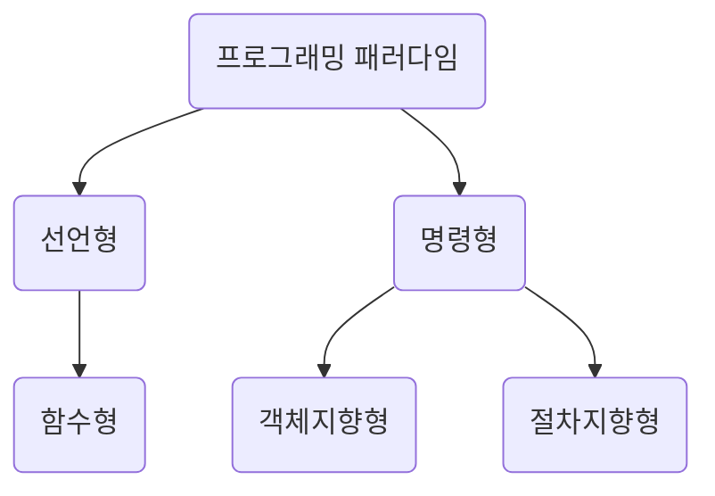

> [스터디](https://commonsite.notion.site/CS-372cc204d2648052884cc97488265e59)를 함께 진행했음

패러다임 : 공동체가 공유하는 지식, 가치, 기법, ... 등을 포함한 전체적인 틀

프로그래밍 패러다임 : 프로그래머들이 갖는 프로그래밍의 관점, 개발 방법론. '무엇을 추구하며 개발할 것인가….' 같은 느낌



## 1.2.1 선언형과 함수형 프로그래밍

선언형 : "무엇을" 풀어내는가에 집중

함수형 프로그래밍 : 순수 함수를 쌓아 로직을 구현. 고차 함수로 재사용성을 높임

자바스크립트에서는 함수형 프로그래밍을 선호하는 경향이 있다.

**배열에서 최댓값을 찾는 로직을 함수형 프로그래밍으로 작성한 코드**

`reduce` 같은 함수를 조합해서 결과를 계산

```javascript
const arr = [1, 2, 3, 4, 5]
const max = arr.reduce((acc, cur) => Math.max(acc, cur))

console.log(max) // 5
```

### 함수형 프로그래밍의 특징

1. **순수 함수** : 출력이 입력에만 의존하는 함수

2. **고차 함수** : 함수를 인수로 받거나, 함수를 반환하는 함수 (`map`이나 `filter` 같은 함수들). 고차 함수를 쓰기 위해서는 해당 언어에서 함수가 일급객체여야 한다.

3. **커링** : 여러 개의 인자를 받는 함수를 인자를 하나씩 받아 차례로 실행할 수 있는 함수로 바꾸는 기법

   ```javascript
   const add = (a) => (b) => a + b;
   console.log(add(1)(2)); // 3
   ```

4. **불변성** : 데이터를 변경해야 할 때 기존 데이터를 직접 변경하지 않고 변경이 필요할 때 새로운 데이터를 만들어 사용하는 성질

> **일급 객체** : 일반적으로 객체에 적용할 수 있는 연산들을 모두 사용할 수 있는 객체를 말한다. 3가지 조건이 있음
>
> - 모든 일급 객체는 **변수나 데이터에 담을 수 있어야** 한다.
> - 모든 일급 객체는 **함수의 파라미터로 전달할 수 있어야** 한다.
> - 모든 일급 객체는 **함수의 반환값으로 사용할 수 있어야** 한다.
>
> 자바스크립트에서는 함수를 변수나 데이터에 담거나, 다른 함수에 파라미터로 전달하거나 반환값으로 사용할 수 있기 때문에 함수가 일급 객체이다.

## 1.2.2 객체지향 프로그래밍

객체 지향 프로그래밍 : 객체들의 집합으로 프로그램을 표현하는 개발 방법론

설계에 시간이 많이 걸리고 다른 패러다임들에 비해서 처리 속도가 상대적으로 느리다는 단점이 있다.

**배열에서 최댓값을 찾는 로직을 객체지향 프로그래밍으로 작성한 코드**

데이터와 동작을 하나의 클래스에 묶음

아래 코드 출처 (약간 수정함) : https://github.com/wnghdcjfe/csnote/blob/main/ch1/14.js

```javascript
class NumberList {
  constructor(arr) {
    this.arr = arr
  }

  getMax() {
    let max = this.arr[0]
    for (let idx = 1; idx < this.arr.length; idx++) {
      max = Math.max(max, this.arr[idx])
    }
    return max
  }
}

const numbers = new NumberList([1, 2, 3, 4, 5])
console.log(numbers.getMax()) // 5

```

### 객체지향 프로그래밍의 특징

1. **추상화** : 핵심적인 개념 또는 기능을 간추려내는 것
2. **캡슐화** : 객체의 속성이나 메서드 중에서 외부에 공개하지 않아도 되는 것은 감추는 것
3. **상속성** : 상위 클래스의 특성을 하위 클래스가 이어받아서 그대로, 또는 확장해서 사용하는 것
4. **다형성** : 하나의 메서드나 클래스가 같은 이름으로 다양하게 동작하는 것
   - 오버로딩(overloading) : 매개변수의 유형이나 개수가 다른 같은 이름의 메서드를 여러 개 두는 것을 말함. 컴파일 중에 발생하는 정적 다형성
   - 오버라이딩(overriding) : 주로 메서드 오버라이딩을 말하는데, 상위 클래스로부터 상속받은 메서드를 하위 클래스에서 재정의하는 것을 말함. 런타임 중에 발생하는 동적 다형성

### 객체 지향 프로그래밍 설계 원칙 (SOLID)

- **단일 책임 원칙 (Single Responsibility Principle, SRP)** : 모든 클래스는 각각 하나의 책임만 가져야 한다는 원칙

- **개방-폐쇄 원칙 (Open Closed Principle, OCP)** : 기존 코드를 변경하지 않으면서 기능을 추가할 수 있어야 한다는 원칙. 확장에 대해서는 열려있으면서 수정에 대해서는 닫혀 있는 원칙이다.

- **리스코프 치환 원칙 (Liskov Substitution Principle, LSP)** : 부모 객체를 자식 객체로 교체해도 문제 없이 동작해야 한다. 즉 자식 클래스는 최소한 자신의 부모 클래스에서 가능한 행위는 수행할 수 있어야 한다는 것이다. => 부모 클래스와 자식 클래스 사이의 행위가 일관성을 가져야 함.

- **인터페이스 분리 원칙 (Interface Segregation Principle, ISP)** : 하나의 일반적인 인터페이스보다 구체적인 여러 개의 인터페이스를 만들어야 한다는 원칙. SRP는 클래스의 단일 책임을 강조한다면, ISP는 인터페이스의 단일 책임을 강조한다.

- **의존 역전 원칙 (Dependency Inversion Principle, DIP)** : 어떤 클래스를 참조해야 할 때, 그 클래스를 직접 참조하지 않고 추상화된 클래스나 인터페이스 같은 상위 요소로 참조하라는 원칙이다. 

  ```mermaid
  block-beta
      columns 4
      A("사용자")
      space
      A --"의존"--> B("인터페이스")
      space
      space:4
      space
      B --> C("하위 모듈")
      B --> D("하위 모듈")
      B --> E("하위 모듈")
  ```

## 1.2.3 절차형 프로그래밍

**절차형 프로그래밍** : 로직이 수행되어야 할 연속적인 계산 과정으로 프로그램을 표현하는 방법론

진행되는 방식 그대로 코드를 구현하면 되기 때문에 가독성이 좋고 실행 속도가 빠르다. => 계산이 많은 작업에 쓰인다.

**배열에서 최댓값을 찾는 로직을 절차형 프로그래밍으로 작성한 코드**

아래 코드 출처 : https://github.com/wnghdcjfe/csnote/blob/main/ch1/17.js

```javascript
const arr = [1, 2, 3, 4, 5];
let max = 0;
for (let idx = 0; idx < arr.length; idx++) {
  max = Math.max(max, arr[idx]);
}
console.log(max); // 5
```

## 1.2.4 패러다임의 혼합

비즈니스 로직이나 서비스 특성을 고려해서 패러다임을 정하는 것이 좋다. 하나의 프로그래밍 패러다임만 사용하는 것도 괜찮지만, 가능하다면 각 패러다임의 장점만 취해서 섞어서 사용할 수도 있다.
