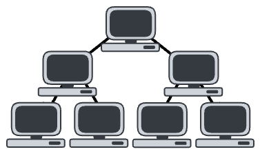
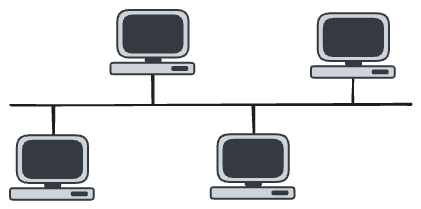
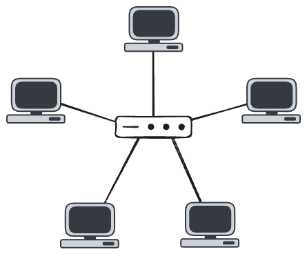
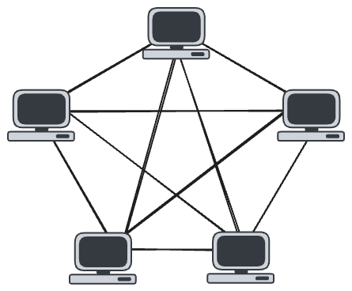
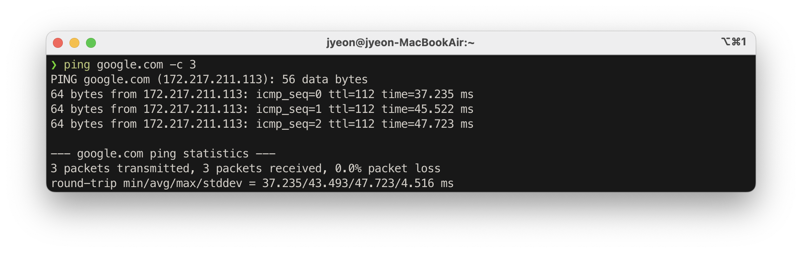
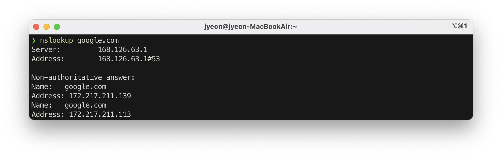

네트워크란 **여러 장치들이나 시스템**이 **연결**되어서 **데이터를 주고받을 수 있게** 만든 **구조**를 말한다.

노드와 링크로 구성된다.

- 노드 : 데이터를 주고받는 대상. 서버, 라우터, 스위치, 컴퓨터
- 링크 : 노드들을 연결하는 통신 매체. 유선, 무선

## 처리량

> **좋은 네트워크**란
>
> - 높은 처리량
> - 낮은 지연시간
> - 낮은 장애 빈도
> - 높은 보안

처리량이란 링크로 전달되는 단위 시간당 데이터 양을 의미한다.

단위로는 bps를 쓰는데 bit per second의 약자로 초당 전송/수신되는 비트의 수이다.

아래 요소들에 영향받는다.

- 트래픽
- 장치 간 대역폭
- 중간 에러
- 하드웨어 스펙

## 지연시간

지연시간이란 요청이 처리되는데 걸리는 시간을 의미한다.

요청을 보내고, 요청을 처리하고 응답이 도착하기까지 걸리는 시간의 합이다.

아래 요소들에 영향받는다.

- 매체 타입 (유/무선)
- 패킷 크기
- 라우터의 패킷 처리 시간

## 네트워크 토폴로지

토폴로지(topology) : 점, 선, 면의 배열 방식

네트워크 토폴로지 : 네트워크 안에서 노드와 링크가 배치되어 있는 모양

### 트리 토폴로지

계층형 토폴로지

- 장점 : 노드의 추가와 삭제가 쉬움
- 단점 : 어떤 노드에 트래픽이 집중되면 하위 노드에 영향을 줌

### 버스 토폴로지

하나의 중앙 회선에 연결되는 구조

근거리 통신망 (LAN) 에서 사용한다.

- 장점 :
  - 설치 비용이 낮다
  - 신뢰성이 높다
  - 노드의 추가와 삭제가 쉬움
- 단점 :
  - 메인 링크가 망가지면 전체 네트워크에 영향을 준다
  - 장애 발견이 어렵다

### 스타 토폴로지

중앙에 있는 노드에 모두 연결된 구성

- 장점 : 
  - 노드를 추가하기 쉽다.
  - 고장난 노드를 감지하기 쉽다
  - 노드 수가 증가해도 패킷의 충돌 발생 가능성이 적다
- 단점 : 
  - 중앙 노드에 문제가 발생한 경우 전체 네트워크를 사용할 수 없다.
  - 설치 비용이 높다.

### 링형 토폴로지

각각의 노드가 양 옆의 두 노드와 연결되어 있는 구조

데이터는 노드에서 노드로 이동함.

- 장점 : 
  - 노드 수가 증가해도 네트워크 상 손실이 거의 없음.
  - 패킷의 충돌 발생 가능성이 적음
  - 노드의 고장을 쉽게 발견할 수 있다
- 단점 : 
  - 네트워크 구성의 변경이 어렵다
  - 노드의 추가, 삭제가 어려움. (전체 네트워크가 중지됨)
  - 회선에 장애가 발생하면 전체 네트워크에 영향을 준다.

### 메시 토폴로지

망형 토폴로지. 그물망처럼 연결되어 있는 구조

- 장점 : 
  - 한 노드에 장애가 발생하더라도 다른 경로를 사용할 수 있으므로 전체 네트워크에 미치는 영향이 적다
  - 트래픽 분산 처리가 가능하다
- 단점 : 
  - 노드 추가가 어렵다
  - 구축 비용과 운용 비용이 높다

## 병목 현상

네트워크 토폴로지가 중요한 이유는 병목 현상을 분석하고 해결 방법을 찾는 데 중요한 기준이 되기 때문이다.

> **병목 현상**
>
> 전체 시스템의 성능이나 용량이 가장 좁은(느린) 하나의 구성 요소로 인해 제한을 받는 현상

## 네트워크의 분류

규모를 기준으로 분류할 수 있다.

- LAN(Local Area Network)
  - 개인적으로 소유 가능한 규모의 소규모 네트워크
  - 같은 건물이나 캠퍼스 내에서 사용하는 네트워크
  - 전송 속도가 높고 혼잡도가 낮다.
- MAN(Metropolitan Area Network)
  - 시 규모의 네트워크. 대도시 지역에서 사용한다.
- WAN(Wide Area Network)
  - 국가, 대륙 규모의 네트워크
  - 전송 속도가 느리고 혼잡도가 높다.

## 네트워크 성능 분석 명령어

병목 현상의 원인

- 네트워크 대역폭
- 네트워크 토폴로지
- 서버 CPU 메모리 사용량
- 비효율적 네트워크 구성

애플리케이션에는 문제가 없는데 응답이 잘 안되는 경우가 있을 수 있음. 이런 경우에 문제의 원인이 정말 네트워크 때문인지를 확인해야 하는데, 이 때 사용할 수 있는 명령어들이 아래와 같다.

1. `ping`

   연결 상태를 확인하려는 노드에 일정 패킷을 보내는 명령어다.

   해당 노드의 수신 상태나, 그 패킷이 도달하기까지의 시간 등을 알 수 있다.

   ping은 TCP/IP 프로토콜 중에 ICMP 프로토콜을 사용하기 때문에 이 프로토콜을 지원하지 않는 경우에는 사용할 수 없다.

   `ping google.com -c 3` 명령을 이용해서 3개의 패킷을 보내 본 결과. 

   

   - google.com으로 ICMP 패킷을 3번 보냄.
   - DNS 조회 결과, google.com은 최종적으로 172.217.211.113로 연결됨.
   - 각 응답에서 패킷이 도착할 때 남아 있는 TTL 값(`ttl`), 왕복 지연 시간(`time`)을 보여줌.
   - 통계: 3개 보냈고 3개 받았다 ➡️ 연결 성공
   - 통계: 패킷 손실이 0.0%이므로 연결이 양호
   - 통계: 최소/평균/최대 응답시간이 각 37.235ms / 43.493ms / 47.723ms

2. `netstat`

   접속된 서비스들의 네트워크 상태 표시

   보통은 서비스에 포트가 열려있는지를 확인한다.

3. `nslookup`

   DNS와 관련된 내용을 확인하는 명령어. (로컬 캐시를 조회하는 것이 아님에 주의!)

   

   

4. `tracert` / `traceroute`

   목적지 노드까지 네트워크 경로를 확인할 때 사용하는 명령어

   어떤 구간에서 응답 시간이 늦어지는지 확인할 수 있다.

## 네트워크 프로토콜 표준화

네트워크 프로토콜 : 서로 다른 장치들끼리 데이터를 주고받기 위한 규약. 공통된 인터페이스

IEEE / IETF 같은 표준화 단체들에서 진행한다.

예를 들면 HTTP 라는 표준화된 프로토콜이 있어서 이 약속된 프로토콜로 여러 노드들이 웹에서 데이터를 주고받을 수 있는 것이다.
