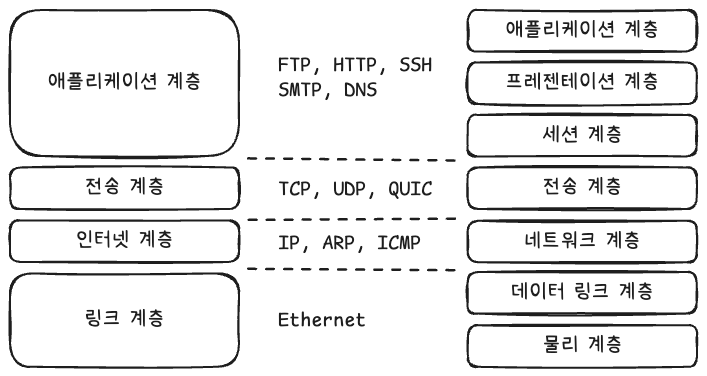
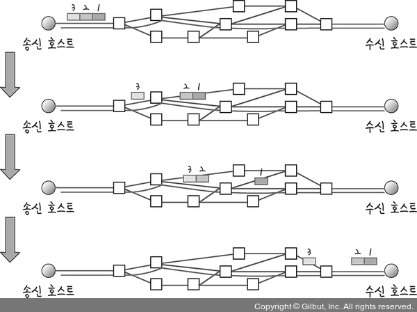
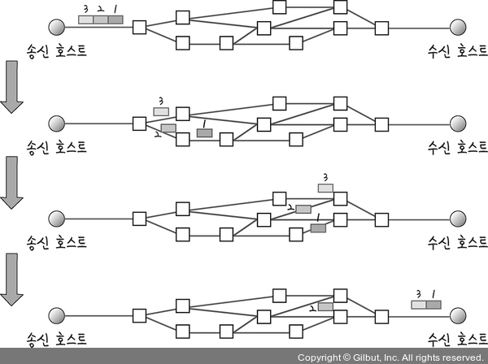
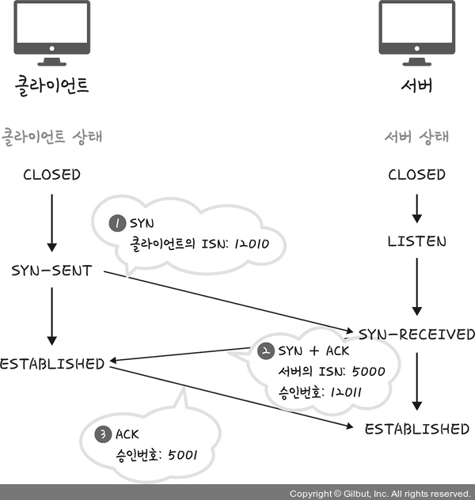
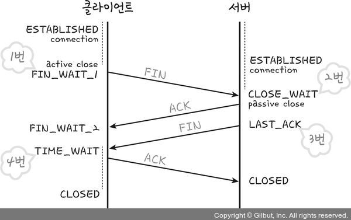
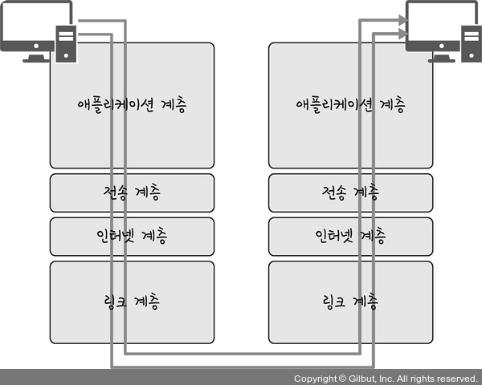

## 계층 구조

스위트 (suite) : 뭔가를 모아둔 것. 집합.

인터넷 프로토콜 스위트 : 인터넷에서 컴퓨터들이 서로 정보를 주고받는데 쓰이는 프로토콜의 집합

인터넷 프로토콜 스위트는 계층 구조로 설명하는데 TCP/IP 4계층 모델이나 OSI 7계층 모델을 사용한다.

TCP/IP 4계층

1. 애플리케이션 계층
2. 전송 계층
3. 인터넷 계층
4. 링크 계층

OSI 7계층

1. 애플리케이션 계층
2. 프레젠테이션 계층
3. 세션 계층
4. 전송 계층
5. 네트워크 계층
6. 데이터 링크 계층
7. 물리 계층

각 계층은 서로 독립적이라 주변 다른 계층이 변경되어도 서로 영향을 받지 않도록 설계되어 있다.

두 모델의 차이는 아래와 같다.

- OSI 7계층의 애플리케이션 계층, 프레젠테이션 계층, 세션 계층을 TCP/IP 4계층에서는 애플리케이션 계층 하나로 묶어서 표현하는 것
- OSI 7계층의 데이터 링크 계층과 물리 계층을 TCP/IP 4계층에서는 링크 계층 하나로 묶어서 표현하는 것
- OSI 7계층의 네트워크 계층이 TCP/IP 4계층에서는 인터넷 계층이라는 것

이 책에서는 TCP/IP 4계층을 중심으로 설명한다. TCP/IP 4계층은 프로토콜의 네트워킹 범위에 따라 4개의 추상화 계층을 둔 것이다.

## 애플리케이션 계층

응용프로그램이 사용되는 계층

사용자들에게 실질적으로 서비스를 제공하는 계층이다.

- FTP : 파일 전송 프로토콜
- SSH : 안전하지 않은 네트워크 환경에서도 보안 채널을 통해 원격 접속을 가능하게 해주는 프로토콜
- HTTP : World Wide Web 에서 데이터를 주고받기 위해 사용하는 프로토콜
- SMTP : 전자 메일 전송 프로토콜
- DNS : 도메인 이름을 IP 주소로 변환하여 사용자가 도메인 이름으로 서버에 연결할 수 있도록 하는 프로토콜

## 전송 계층

송신자와 수신자를 연결하는 통신을 담당하는 계층

TCP와 UDP가 전송 계층의 프로토콜이다.

### 패킷 교환 방식

TCP는 가상 회선 패킷 교환 방식을, UDP는 데이터그램 패킷 교환 방식을 사용한다.

**가상 회선 패킷 교환 방식**

데이터를 전송하기 전에 논리적 연결이 설정되는데 이걸 가상 회선이라고 한다.(=> 연결 지향) 각 패킷에 VCI라는 가상 회선 식별 번호가 포함된다.

모든 패킷이 전송된 순서대로 도착한다.

**데이터그램 패킷 교환 방식**

각 패킷들이 독립적으로 전달된다.

하나의 메시지에서 분할된 여러 패킷이 독립적으로 최적의 경로를 따라서 이동한다. (=> 비연결 지향형)

경로가 다르니까 송신 측에서 전송한 순서와 수신 측에 도착한 순서가 다를 수 있다.

그림 출처 : https://thebook.io/080326/0077/ , https://thebook.io/080326/0078/

### TCP 연결 - 3-way handshake

TCP는 신뢰성 확보를 위해 연결 시에 3-way handshake 과정을 거친다.

그림 출처 : https://thebook.io/080326/0079/

**① 클라이언트에서 서버로 클라이언트의 ISN을 담아 SYN 세그먼트 전송**

**② 서버에서 SYN을 수신하고, 서버의 ISN과 클라이언트 ISN + 1로 설정한 승인번호를 담아 SYN + ACK 세그먼트 전송**

**③ 클라이언트에서 서버 ISN + 1로 설정한 승인번호를 담아 ACK 세그먼트 전송**

> **SYN** : TCP 헤더의 제어 플래그 중 하나. 연결 요청을 의미함
>
> **ACK** : TCP 헤더의 제어 플래그 중 하나. 응답을 의미함
>
> **ISN** : 연결 시작 때 각 호스트가 처음 선택하는 초기 시퀀스 번호 값
>
> SYN 세그먼트, ACK 세그먼트란 해당 플래그가 1로 설정된 TCP 세그먼트

### TCP 연결 해제 - 4-way handshake

연결을 해제할 때는 4-way handshake 과정을 거친다.

그림 출처 : https://thebook.io/080326/0081/

**① 클라이언트에서 연결 해제를 위해 FIN 세그먼트를 서버에 보냄. 보낸 뒤에 클라이언트는 FIN_WAIT_1 상태에 들어간다.**

**② 서버에서는 FIN 세그먼트를 받고 연결 종료 요청을 확인했음을 알리는 ACK 세그먼트를 보낸다. 보낸 뒤에 서버는 CLOSE_WAIT 상태에 들어간다.**

**③ ACK 세그먼트를 받은 클라이언트는 FIN_WAIT_2 상태에 들어간다.**

**④ "일정 시간 이후에" CLOSE_WAIT 상태의 서버는 FIN 세그먼트를 보낸다.**

**⑤ 클라이언트는 FIN 세그먼트를 받고 ACK 세그먼트를 서버에 보낸다. 보낸 뒤에 클라이언트는 TIME_WAIT 상태에 들어간다.**

**⑥ ACK를 받은 서버는 CLOSED 상태가 된다. 클라이언트는 TIME_WAIT 상태에서 일정 시간 대기한 뒤 CLOSED 상태가 되어 연결이 닫힌다.**

특이한 부분은 서버에서도, 클라이언트에서도 일정 시간을 기다린다는 점이다.

- 지연 패킷 누락을 방지하기 위해서 : 뒤늦게 도착하는 패킷을 처리하지 못한다면 데이터 무결성 문제 발생함.
- 실제로 두 장치가 연결이 닫혔는지를 확인하기 위해서

## 인터넷 계층

네트워크 패킷을 IP 주소로 지정된 목적지로 전송하기 위해 사용되는 계층.

IP, ARP, ICMP가 이 계층에서 사용되는 프로토콜이다.

상대가 제대로 받았는지를 보장하지 않는 비연결형적인 특징이 있다.

## 링크 계층

전선, 광섬유, 무선 같은 매체로 실질적으로 데이터를 전달하는 계층

OSI 7계층에는 이 링크 계층을 둘로 나눈다.

- 물리 계층 : 무선/유선 LAN을 이용해 0과 1로 된 데이터를 보내는 계층
- 데이터 링크 계층 : 이더넷 프레임을 통해 에러 확인, 흐름 제어

## 계층 간 통신 과정

그림 출처 : https://thebook.io/080326/0092/

클라이언트에서 서버로 HTTP 요청을 보내면 
→ 애플리케이션에서부터 요청 값들이 캡슐화 과정을 거치면서 링크 계층으로 이동.
→ 링크 계층에서 서버와 통신
→ 서버 쪽 링크 계층에서부터 애플리케이션 계층까지 비캡슐화 과정을 거치면서 데이터가 전송됨

### 캡슐화 과정

상위 계층의 데이터와 헤더를 하위 계층의 데이터 부분에 넣고, 하위 계층의 헤더를 넣는 과정을 말함

그림 출처 : 

하위 계층 헤더로 계속 싸서 보내는 구조.

데이터(원본) → 세그먼트/데이터그램(TCP 헤더가 붙음) → 패킷(IP 헤더가 붙음) → 프레임(프레임헤더, 프레임 트레일러가 붙음)

### 비캡슐화 과정

하위 계층에서 상위 계층으로 가면서 각 계층의 헤더를 제거하는 과정

## PDU

PDU : Protocol Data Unit. 어떤 계층에서 다른 계층으로 데이터가 전달될 때 그 데이터 덩어리의 단위를 말한다.

구성

- 헤더 : 제어 관련 정보
- 페이로드 : 데이터

각 계층별로 부르는 이름

- 애플리케이션 계층에서는 메시지라 한다.
- 전송 계층에서는 세그먼트(TCP) 또는 데이터그램(UDP)이라 한다.

- 인터넷 계층에서는 패킷이라 한다
- 링크 계층에서는 프레임(데이터 링크 계층) 또는 비트(물리 계층)라고 한다.

---

애플리케이션 계층을 예로 들면 PDU가 메시지, 즉 문자열이다.

그래서 curl 명령어로 요청을 보낼 때 문자열로 요청하고, 그 요청 결과로 받은 응답도 문자열이다.

PDU 중 가장 아래 계층의 PDU인 비트가 가장 송수신이 빠르지만, 문자열이 authorization 값을 넣는다거나 하는 확장이 쉽기 때문에 애플리케이션 계층에서는 문자열 메시지를 PDU로 사용하는 것이다.
