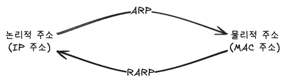
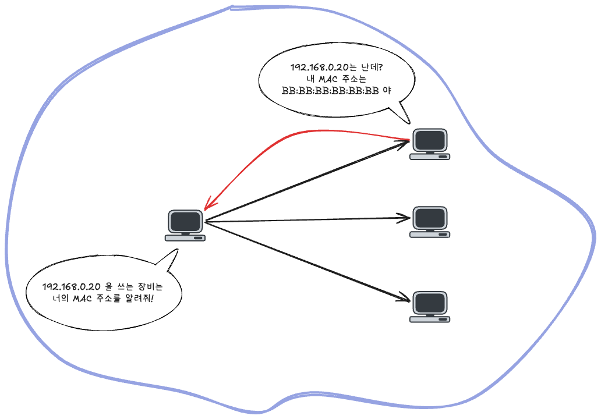
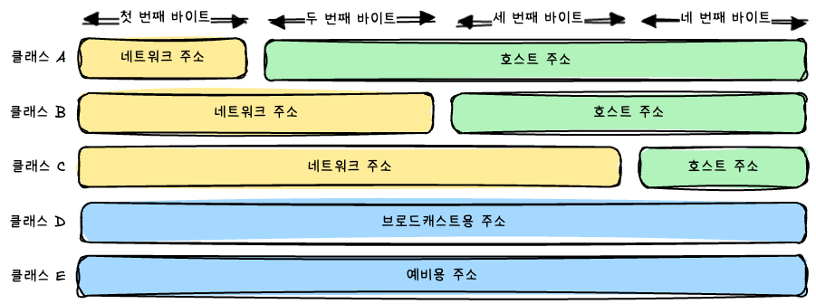
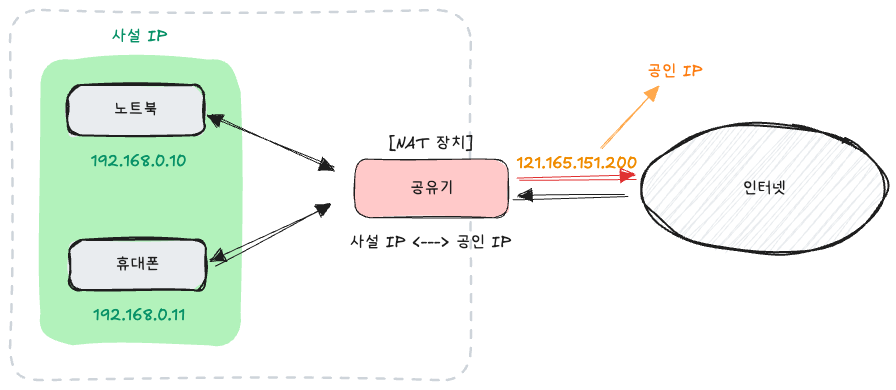

> [스터디](https://commonsite.notion.site/CS-372cc204d2648052884cc97488265e59)를 함께 진행했음

## ARP

컴퓨터와 컴퓨터 사이의 통신은 흔히 IP 주소를 기반으로 한다고 하지만, 엄밀히 말하면 IP 주소를 이용해서 알아낸 MAC 주소를 기반으로 한다고 할 수 있다.

이 때 IP 주소를 이용해서 MAC 주소를 알아내는 프로토콜이 바로 **ARP(Address Resolution Protocol)**이다.

반대는 RARP(Reverse Address Resolution Protocol). MAC 주소를 기반으로 IP 주소를 알아내는 프로토콜이다.



---

**같은 LAN 안에서 데이터를 전달할 때**의 구조는 아래와 같다.

```
Ethernet 프레임
├── 출발지 MAC 주소
├── 목적지 MAC 주소 // 이게 필요하다!
└── IP 패킷
    ├── 출발지 IP 주소
    ├── 목적지 IP 주소
    └── 실제 데이터
```

IP 패킷을 보내려면 이더넷 프레임을 만들어서 보내야 한다. 그런데 이때 목적지 MAC 주소를 함께 넣어야 하는데... 목적지 IP 주소는 알지만 MAC 주소는 모른다. 이 때 쓰게 되는 것이 ARP이다.

컴퓨터 A가 컴퓨터 B에게로 데이터를 보내는 흐름에서의 ARP 과정을 정리하면 이렇다.

1. A는 먼저 자신의 **ARP 캐시를 확인**한다. 기록이 있다면 요청X. 기록이 없다면 ARP 요청을 보낸다.
2. A는 **ARP Request를 브로드캐스트**한다.
   ```
   나는 192.168.0.10이고 MAC 주소는 AA:AA:AA:AA:AA:AA임.
   192.168.0.20을 사용하는 장비는 자신의 MAC 주소를 알려 줘라.
   ```
   이 요청도 당연히 이더넷 프레임 안에 담긴다. 이 때 목적지 MAC 주소는 `FF:FF:FF:FF:FF:FF` 로 담기는데 이건 이더넷 브로드캐스트 주소임.
3. 같은 LAN에 연결된 각 장비는 요청에 있는 IP 주소를 확인한다.
   B는 자신의 IP 주소와 동일하다는 것을 확인하고 **ARP Reply를 보낸다**. 다른 장비들은 보내지 않는다.
   ```
   192.168.0.20은 난데,
   내 MAC 주소는 BB:BB:BB:BB:BB:BB임.
   ```
   이미 A의 MAC 주소를 알고 있기 때문에 B는 해당 요청을 브로드캐스트 할 필요 없이 A에게만 유니캐스트로 전송한다.
4. A는 응답을 받고 **일정 시간 동안 ARP 캐시에 저장**한다.
   그리고 **실제 요청이 담긴 IP 패킷을 이더넷 프레임에 담아서 B에 전송**할 수 있다.



---

**외부 서버로 접속할 때는 서버의 MAC 주소를 직접 찾지 않는다**. 컴퓨터 A가 다른 LAN에 있는 컴퓨터 C에 데이터를 보내는 상황을 가정해보자. 

외부 브로드캐스트는 라우터를 넘어가지 않기 때문에 A가 ARP를 이용해서 C의 MAC 주소를 알 수 없다. 그래서 A는 기본 게이트웨이의 MAC 주소를 ARP를 이용해서 알아내서 그쪽으로 요청을 보내게 된다.

> RARP는 처음 켜진 컴퓨터가 자신의 IP 주소를 알아낼 때 사용된다.
>
> MAC 주소의 경우에는 랜카드에 하드코딩되어 있기 때문에 처음부터 알고 있지만, IP 주소는 네트워크 환경에 따라 달라질 수 있기 때문에 켜진 상황에서의 IP 주소를 알아야 할 필요가 있다.
>
> 그래서 같은 네트워크에 있는 모든 장비에게 자신의 MAC 주소와 함께 "내 IP를 알려달라!" 하고 브로드캐스트하는 것. 그럼 그 요청을 받은 RARP 서버가 IP 주소를 응답해준다.
>
> 그런데 RARP는 과거 방식이고, 요즘은 같은 역할을 더 잘 수행하는 DHCP를 사용한다. RARP는 단순히 IP 주소를 알려주는 역할만 하는 반면에 DHCP는 IP 주소 외에도 기본 게이트웨이와 DNS 서버 주소 같은 것을 함께 알려준다.

## 홉바이홉 통신

홉바이홉(hop-by-hop) 통신은 패킷이 최종 목적지까지 한 번에 전달되는 것이 아니라, 여러 라우터를 거쳐 한 단계씩 전달되는 방식의 통신을 말한다.

```text
내 컴퓨터 → 공유기 → 통신사 라우터 → 다른 라우터 → 서버
```

패킷이 한 라우터에서 다음 라우터로 이동하는 한 단계를 홉(hop)이라고 한다.

각 라우터는 패킷의 최종 목적지 IP 주소를 확인하고, 자신의 라우팅 테이블을 조회하여 패킷을 넘겨줄 다음 홉을 결정한다. 이처럼 패킷을 전달할 경로를 결정하는 과정을 라우팅(routing)이라고 한다.

패킷을 전달받은 다음 라우터도 같은 작업을 반복한다.

```text
목적지 IP 주소 확인
→ 라우팅 테이블 조회
→ 다음 홉 결정
→ 패킷 전달
→ 다음 라우터에서 반복
→ 최종 목적지 도착
```

즉, 각 라우터가 라우팅을 수행하여 패킷을 다음 홉으로 넘기고, 이 과정이 반복되면서 패킷이 최종 목적지에 도달한다. 이러한 통신 방식을 홉바이홉 통신이라고 한다.

---

라우팅 테이블이란 목적지에 따라 패킷을 어떻게 보낼지 기록한 규칙 목록이다.

| 목적지 네트워크 | 게이트웨이    |
| --------------- | ------------- |
| 192.168.0.0/24  | 직접 연결     |
| 10.0.0.0/8      | 192.168.0.254 |
| 0.0.0.0/0       | 192.168.0.1   |

이런 식으로 정리되어 있는데 각 줄을 해석하면 아래와 같다고 할 수 있다.

```
목적지가 192.168.0.x라면
→ 같은 네트워크에 있으므로 직접 전달한다.

목적지가 10.x.x.x라면
→ 192.168.0.254에게 넘긴다.

그 밖의 목적지라면
→ 192.168.0.1에게 넘긴다.
```

---

게이트웨이란 다른 네트워크로 가기 위해 패킷을 넘겨줄 다음 라우터이다.

같은 네트워크에 있는 목적지에 보내기 위해서는 상대 컴퓨터에 직접 전달할 수 있다. 하지만 다른 네트워크에 있는 목적지에 보내는 경우에는 직접 전달하지 않고 게이트웨이인 공유기에 전달하는 방식이다.


## IP 주소 체계

- IPv4 : 32비트를 8비트 단위로 구분해서 표기 (`192.168.0.10`)
- IPv6 : 128비트를 16비트 단위로 구분해서 표기 (`2001:db8::ff00:42:8329`)

IPv6로 전환하는 추세긴 하지만, 여전히 IPv4가 가장 많이 쓰인다.

---

과거에는 IPv4 주소를 클래스 단위로 할당했다. IP 주소를 네트워크 주소와 호스트 주소로 나누고, 네트워크 규모에 따라서 클래스 A, B, C, D, E 로 구분하는 **클래스 기반 할당 방식**을 썼다.

- 네트워크 주소 : 어떤 네트워크인가?
- 호스트 주소   : 해당 네트워크 안의 어떤 장치인가?



클래스 A, B, C에서는 각각 네트워크 주소로 앞의 1바이트, 2바이트, 3바이트를 사용한다.

```
[클래스 A]
네트워크 주소   | 호스트 주소
8비트         | 24비트
10           | 0.0.1

[클래스 B]
네트워크 주소   | 호스트 주소
16비트        | 16비트
172.16       | 0.1

[클래스 C]
네트워크 주소   | 호스트 주소
24비트        | 8비트
192.168.0    | 10
```

일반적인 IPv4 네트워크에서는 첫 번째 주소는 네트워크 주소로 사용되고, 가장 마지막 주소는 브로드캐스트용 주소로 네트워크에 속해 있는 모든 컴퓨터에 데이터를 보낼 때 사용된다.


클래스 기반 할당 방식의 문제점은 선택지가 너무 거칠다는 것이다.

- 클래스 C : 하나의 네트워크에 약 254개 주소
- 클래스 B : 하나의 네트워크에 약 65,534개 주소

예를 들어서 장치 300개에 주소를 할당해야 한다면 클래스 C는 부족하다. 그렇다고 클래스 B를 할당하면 사용하지 않는 나머지의 주소들을 낭비하게 된다. 고정된 크기의 주소 묶음을 할당해야 하기 때문에 네트워크의 크기를 세밀하게 조절하기 어려워 사용하지 않는 주소가 많이 발생한다는 문제가 발생한다.

이 문제를 해결하기 위해서 현재는 클래스 기반 방식 대신 **CIDR(Classless Inter-Domain Routing)**을 사용한다. CIDR은 `/24` 같은 접두사 길이를 이용해서 네트워크 크기를 더 유연하게 지정할 수 있는 방법이다.

CIDR에서는 네트워크 주소로 사용할 비트 수를 `/숫자` 로 직접 표현한다.

```
192.168.0.0/24
```

`/24`는 앞의 24비트를 네트워크 주소로 사용한다는 의미이다.

| 네트워크 주소 | 호스트 주소  |
| ------------- | ------------ |
| 앞의 24비트   | 나머지 8비트 |
| 192.168.0     | 0            |

바이트 단위가 아닌 비트 단위로 네트워크 주소의 범위를 지정하기 때문에, 클래스 기반 할당 방식과는 달리 8비트 단위가 아닌 경계도 사용할 수 있다는 이점이 있다.

```
192.168.0.0/26
```

- 네트워크 주소       : 192.168.0.0
- 사용 가능한 주소    : 192.168.0.1 ~ 192.168.0.62
- 브로드캐스트 주소   : 192.168.0.63

---

**DHCP(Dynamic Host Configuration Protocol)**는 장치에 IP 주소와 네트워크 설정을 자동으로 할당하는 네트워크 관리 프로토콜이다. 이걸 통해서 네트워크 장치의 IP 주소를 직접 수동으로 설정할 필요가 없게 되었다.

장치가 네트워크에 연결되면 DHCP 서버로부터 일정 기간 사용할 설정을 받는다.

- IP 주소
- 서브넷 마스크
- 기본 게이트웨이
- DNS 서버 주소

가정에서는 일반적으로 공유기가 DHCP 서버의 역할을 수행한다.

---

**NAT(Network Address Translation)**은 패킷의 IP 주소를 다른 IP 주소로 변환하는 기술이다.

IPv4 주소 체계만으로는 많은 주소들을 모두 감당하지 못하는 문제가 있는데, 이를 해결할 수 있는 방법 중 하나가 NAT를 이용해서 주소들을 공인 IP와 사설 IP로 나누어서 처리하는 것이다.



가정용 네트워크를 예를 들면, 각 장치가 사설 IP 주소를 사용한다.

장치가 인터넷에 요청을 보내면, 공유기는 사설 IP 주소를 공인 IP 주소로 변환한다. 그리고 응답이 돌아오면 변환 기록을 확인해서 요청을 보낸 장치에 응답을 전달한다.

```
노트북
192.168.0.10
    ↓
공유기에서 주소 변환
    ↓
공인 IP 주소
    ↓
인터넷
```

NAT를 사용하면 내부의 사설 IP 주소가 외부에 직접 노출되지 않는다. 하지만 보안 기능이라고 하기는 어렵고, 외부 접근을 통제하는 역할은 방화벽이 담당한다.

NAT의 주요 단점은 여러 장치가 하나의 인터넷 회선을 함께 사용하면서 속도가 느려질 수 있다는 것과, 주소 변환이라는 하나의 단계가 추가된다는 것과, 외부에서 내부 장치로 직접 연결하기 어려워진다는 것이 있다.
