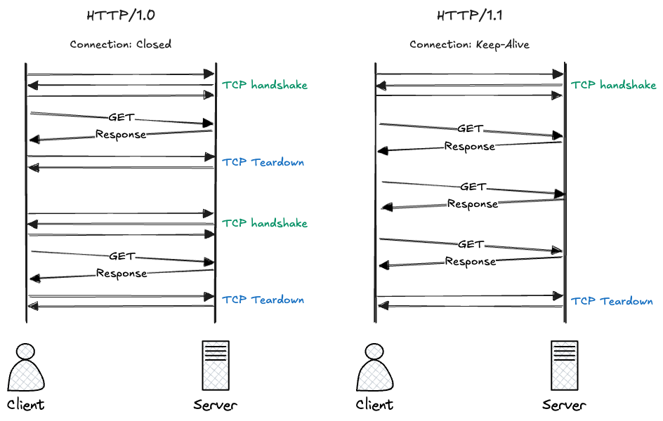
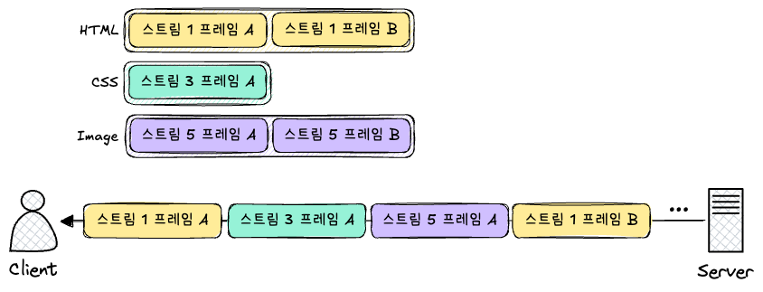
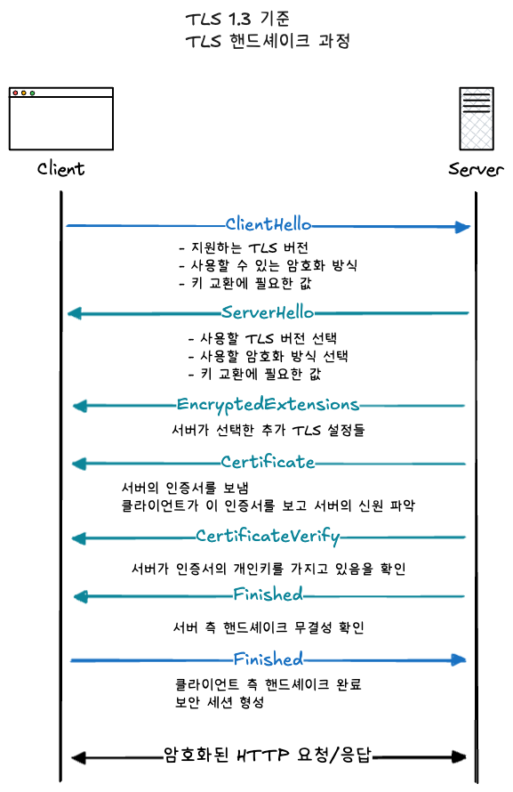
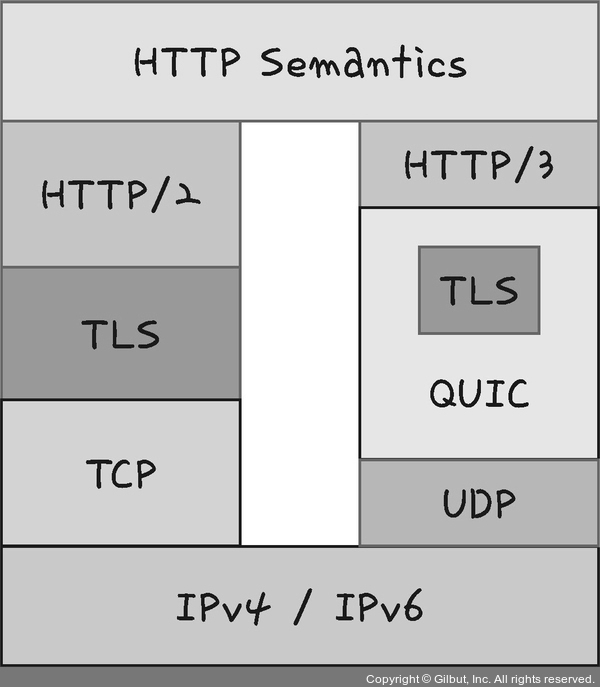

> [스터디](https://commonsite.notion.site/CS-372cc204d2648052884cc97488265e59)를 함께 진행했음

HTTP : Hyper Text Transfer Protocol. 웹 브라우저와 서버가 인터넷 상에서 정보를 주고받기 위한 프로토콜

초기 HTTP/1.0에서 점점 발전해서, 지금은 HTTP/3까지 왔다.

## HTTP/1.0

기본적으로 한 연결당 하나의 요청을 처리하도록 설계되어 있다.

서버로부터 파일을 가져올 때 마다 TCP의 3-way handshake를 거쳐야 하기 때문에 RTT가 크다는 단점이 있었다.

> RTT : Round Trip Time
>
> 데이터 패킷이 클라이언트에서 서버로 이동했다가 다시 돌아오는데 걸리는 시간. 패킷 왕복 시간.

RTT의 증가를 해결하기 위한 방법으로 **이미지 스플리팅**, **코드 압축**, **이미지 Base64 인코딩**을 사용하곤 했었다.

---

**이미지 스플리팅**

페이지 안에 많은 이미지가 있다면, 그 개별 이미지마다 연결을 새로 해야 하기 때문에 과부하가 걸릴 수 있다. 따라서 필요한 이미지들을 합친 하나의 이미지를 다운로드받아서, 위치를 기반으로 쪼개서 사용하는 **이미지 스플리팅**이라는 방법을 사용했다.

하나의 큰 이미지를 background-image로 설정하고, background-position 속성을 이용해서 실제로 보여줄 위치를 설정하는 방식이다... ~~이런 방법이 쓰인게 실화라니 충격적~~

---

**코드 압축**

코드에서 개행 문자, 빈칸을 없애서 코드 용량을 줄이는 방법이다.

---

**이미지 Base64 인코딩**

> 인코딩 : 정보의 형태나 형식을 다른 형태나 형식으로 변환하는 처리 방식

Base64는 문자열 형식이기 때문에 이미지를 위한 별도의 연결이 불필요하다는 장점이 있다.

하지만 Base64로 인코딩한 이미지는 인코딩 전보다 크기가 커진다는 단점이 있다.

## HTTP/1.1

HTTP/1.1에서는 매번 TCP 연결을 하지 않아도 되도록 `keep-alive` 라는 옵션을 표준화했다. (HTTP/1.0에도 있었으나 그때는 비표준 옵션이었다.)

`keep-alive` 옵션으로 인해서 한 번 TCP 초기화를 한 이후에 여러 개의 파일을 송수신할 수 있게 되었다.



하나의 연결에서 여러 요청을 처리할 수 있게 되었지만, **하나의 연결에서 여러 요청을 병렬처리할 수 없다는 문제**는 여전히 남아 있었다. 따라서 한 페이지에 여러 리소스가 필요한 경우, 리소스의 개수에 비례해서 대기시간이 길어진다는 단점이 있었다.

그리고 **헤더 압축 기능이 없다**는 문제가 있었다. 요청마다 쿠키와 같은 헤더가 반복해서 전송되기 때문에 무겁다는 단점도 있었다.

---

**HOL Blocking**

HOL Blocking : Head Of Line Blocking

같은 큐에 있는 패킷이 앞선 패킷에 의해 지연될 때 발생하는 성능 지연 현상

HOL Blocking이 발생한다는 것은 HTTP/1.1의 주요 단점 중 하나였다.

## HTTP/2

Google이 HTTP/1.1의 성능 문제를 개선하기 위해 만든 실험적인 프로토콜인 SPDY(speedy처럼 읽는다.) 프로토콜을 기반으로 HTTP/2가 만들어졌다. HTTP/2에서는 HTTP/1.X보다 지연시간을 줄이고 응답시간을 단축시켰다.

멀티플렉싱, 헤더 압축, 서버 푸시, 요청의 우선순위 처리 같은 기능들을 지원했다.

---

**멀티플렉싱**

멀티플렉싱 : 여러 개의 스트림을 사용해서 송수신하는 것. 하나의 TCP 연결을 통해 여러 요청과 응답을 동시에 주고받는 방식이다.

HTTP/1.1에서는 하나의 TCP 연결에서 응답이 순서대로 처리되는 방식이었다.

``` 
요청: HTML → CSS → 이미지
응답: HTML → CSS → 이미지
```

따라서 앞 응답에 따라 뒤 응답이 지연되는 HOL Blocking 이 발생하는 문제가 있었다.

HTTP/2에서는 각각의 요청과 응답을 별도의 스트림(stream)으로 구분했다.

```
스트림 1: HTML 요청과 응답
스트림 3: CSS 요청과 응답
스트림 5: 이미지 요청과 응답
```

그리고 각 스트림의 데이터는 더 작은 단위인 프레임으로 나뉘었다. 각 프레임에는 자신이 속한 스트림을 확인할 수 있는 식별자가 기록되어서 섞여도 괜찮았다. 그래서 서버는 하나의 TCP 연결을 통해서 여러 스트림의 프레임을 섞어서 보낼 수 있었고, 클라이언트는 프레임에 기록된 스트림 식별자를 확인하고 데이터를 다시 조립할 수 있었다.



이렇게 하면 HTML 응답의 크기가 크거나 처리가 늦어지더라도 CSS 응답을 먼저 처리할 수 있다. 따라서 HTTP/1.1에서 발생하던 HOL Blocking을 해결할 수 있었다. 

---

**헤더 압축**

웹 페이지를 불러올 때는 HTML, CSS, JS, Image 등을 각각 요청하게 되는데, 이 때 쿠키나 User-Agent처럼 비슷한 헤더가 요청마다 반복된다.

HTTP/1.1에는 헤더 압축 방식이 없기 때문에 헤더를 반복해서 보내야 했고, 이로 인해서 불필요하게 큰 데이터를 전송해야 했다.

HTTP/2에서는 **허프만 코딩 압축 알고리즘을 사용하는 HPACK 이라는 형식을 이용해서 헤더를 압축**한다.

> **허프만 코딩**
>
> 문자열을 문자 단위로 쪼개서 빈도수를 세서, 등장 빈도가 높은 문자에는 적은 비트수를, 등장 빈도가 낮은 문자에는 비트 수를 많이 사용해서 표현해서 전체 데이터의 표현에 필요한 비트양을 줄이는 방식이다.

---

**서버 푸시**

서버 푸시(server push)는 클라이언트가 요청하기 전에 서버가 필요할 것으로 예상되는 리소스를 미리 보내는 기능이다.

HTML에는 CSS나 JS 파일이 포함되므로 HTML을 요청받았을 때, 서버가 HTML을 응답하면서 함께 필요할 것으로 예상되는 CSS, JS 파일을 함께 전송하는 개념이다. 이를 통해서 서버에서 CSS 요청을 기다리는 시간을 줄일 수 있었다.

요즘은 잘 사용하지 않는데, 서버가 클라이언트의 캐시 상태를 정확히 알기 어렵기 때문이다. 요즘은 `preload` 같은 대안을 주로 사용한다.

## HTTPS

HTTPS는 애플리케이션 계층과 전송 계층 사이에 신뢰 계층인 SSL/TLS 계층을 넣은 신뢰할 수 있는 HTTP 요청을 말한다.

```
HTTP
↓
TLS
↓
TCP
↓
IP
```

---

SSL/TLS는 전송 계층에서 보안을 제공하는 프로토콜. 3가지를 보장하기 위해 사용한다.

1. 암호화 : 제 3자가 통신 내용을 읽지 못하게 한다
2. 무결성 : 데이터가 중간에 몰래 변경되었는지 확인한다
3. 인증 : 접속한 서버가 실제 서버인지 확인한다.

---

HTTPS에서는 HTTP 메시지를 보내기 전에 **TLS 핸드셰이크**를 수행한다.



이렇게 TLS 핸드셰이크 과정이 수행되면, 안전한 연결상태가 준비되고 이를 **보안 세션**이라고 한다.

> 세션
>
> 브라우저와 서버가 한동안 공유하는 통신 상태

보안 세션 덕분에 매 요청마다 처음부터 인증과 키 교환을 반복하지 않아도 된다.

- 처음 연결할 때 → TLS 핸드셰이크로 보안 세션 생성
- 이후 같은 연결에서 요청/응답 → 이미 만들어진 세션 정보를 사용하여 암호화 통신

---

사이퍼 슈트는 프로토콜, AEAD 사이퍼 모드, 해싱 알고리즘이 나열된 규약을 말한다. 즉 TLS 통신에서 사용할 암호화 알고리즘 조합.

보통 이런 모양으로 되어 있고, 총 5가지가 있다.

```
TLS_AES_128_GCM_SHA256
```

- TLS : TLS 프로토콜에서 사용하는 규약
- AES_128_GCM : 실제 데이터를 암호화하고 무결성을 확인하는 AEAD 사이퍼 모드
- SHA256 : 키 생성과 핸드셰이크 검증 등에 사용하는 해싱 알고리즘

클라이언트는 ClientHello에서 자신이 지원하는 사이퍼 슈트 목록을 서버에 보낸다. 서버는 그중 하나를 선택해서 ServerHello로 알려 준다.

---

**AEAD(Authenticated Encryption with Associated Data)** 는 데이터 암호화 알고리즘인데, 암호화와 인증을 함께 제공하는 방식이다.

- 암호화 → 데이터를 읽을 수 없게 만든다.
- 인증/무결성 확인 → 데이터가 중간에 변경되지 않았는지 확인한다.

`AES_128_GCM` 등이 있는데, 이건 다음 의미이다.

- AES : 대칭키 암호화 알고리즘
- 128 : 128비트 키 사용
- GCM : 암호화와 무결성 검증을 함께 제공하는 모드

---

**인증 메커니즘**은 "지금 접속한 서버가 진짜 그 서버인가?" 를 확인하는 과정이다. **CA(Certificate Authorities)에서 발급한 인증서**를 기반으로 이루어진다.

인증서에는 아래와 같은 정보들이 담겨 있다.

- 서버 도메인
- 서버의 공개키
- 인증서 유효 기간
- 인증서를 발급한 CA 정보
- CA의 디지털 서명

---

**CA 발급 과정**은 아래와 같다.

1. 서버 운영자가 공개키와 개인키 쌍을 만든다.
2. 공개키와 도메인 정보를 담아 인증서 서명 요청(CSR)을 만든다.
3. CA에 인증서 발급을 요청한다.
4. CA는 도메인 소유권 등을 검증한다.
5. CA는 서버의 공개키와 도메인 정보에 디지털 서명을 붙여 인증서를 발급한다.
6. 서버는 인증서와 개인키를 사용해 HTTPS를 제공한다.

> 개인 키
>
> 개인이 소유하고 있는 키이자 반드시 자신만이 소유해야 하는 키
>
> 공개 키
>
> 공개되어 있는 키

---

**키 교환 알고리즘**

클라이언트와 서버가 실제 데이터 암호화에 사용할 비밀 값을 만드는 과정

TLS 1.3에서는 ECDHE, DHE 2가지 알고리즘을 사용하는데, 이거 둘다 디피-헬만 방식을 근간으로 만들어졌다.

**디피-헬만 키 교환 알고리즘**은 비밀 값을 직접 보내지 않고도 양쪽이 같은 비밀 값을 만들 수 있게 하는 방법이다.

1. 처음에 공개 값을 공유하고 각자의 비밀 값과 혼합한 뒤 혼합 값을 공유
2. 각자의 비밀 값과 또 혼합
3. 공통의 암호키가 생성된다.

이렇게 공유 비밀(shared secret)(또는 세션 키)을 생성해서, 악의적인 공격자가 개인키나 공개키를 가지고도 아무것도 하지 못하게 하는 방식이다.

---

**해싱 알고리즘**은 데이터를 고정된 길이의 값으로 바꾸는 알고리즘이다. 데이터를 추정하기 힘든 더 작고 섞여 있는 조각으로 만든다.

SSL/TLS에서는 해싱 알고리즘으로 **SHA-256 알고리즘**을 많이 쓴다.

**SHA-256**은 결과가 256비트인 해시 알고리즘이다.

---

HTTPS 구축 방법은 크게 3가지이다.

1. 서버에 직접 인증서를 설치한다. : 브라우저 → HTTPS → 웹 서버
2. 서버 앞단의 로드밸런서에서 HTTPS를 처리한다. : 브라우저 → HTTPS → 로드밸런서 → HTTP 또는 HTTPS → 웹 서버
3. 서버 앞단의 CDN에서 HTTPS를 처리한다. : 브라우저 → HTTPS → CDN → 원본 서버

## HTTPS와 SEO

Google이 HTTPS 서비스를 하는 사이트가 그렇지 않은 사이트보다 SEO 순위가 높을 것이라고 공식적으로 밝힌 적이 있다.

---

**캐노니컬 설정**은 중복되거나 비슷한 페이지가 여러 URL로 접근될 때 대표 URL을 알려 주는 설정이다.

```html
<link rel="canonical" href="https://example.com/page" />
```

**메타 설정**도 중요합니다.

**페이지 속도 개선**도 SEO와 관련된다. 페이지가 너무 느리면 사용자 경험이 나빠지는데, 검색 엔진도 페이지 경험을 평가할 때 속도 관련 지표를 참고한다. 구글에서 제공하는 [PageSpeed Insights](https://pagespeed.web.dev/) 를 이용해서 서비스 페이지 속도 리포팅을 받을 수 있다.

**사이트맵**은 검색 엔진에게 사이트의 주요 URL을 알려 주는 XML 파일이다.

```xml
<urlset xmlns="http://www.sitemaps.org/schemas/sitemap/0.9">
  <url>
    <loc>https://example.com/</loc>
    <lastmod>2026-06-03</lastmod>
  </url>
</urlset>
```

사이트맵은 검색엔진이 사이트를 더 효율적으로 크롤링하도록 돕는다.

## HTTP/3

TCP 위에서 돌아가는 HTTP/2와는 달리 HTTP/3은 QUIC 이라는 계층 위에서 UDP 기반으로 돌아간다.



그림 출처 : https://thebook.io/080326/0142/

QUIC은 TCP를 사용하지 않기 때문에 통신을 시작할 때 번거로운 3-way handshake 과정을 거치지 않아도 된다. 클라이언트와 서버가 한 번씩 신호를 보내면 바로 본 통신을 시작할 수 있는 것이다.
