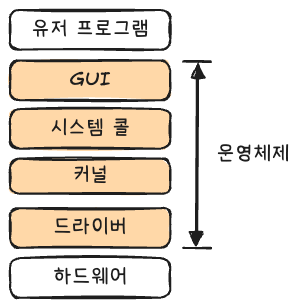
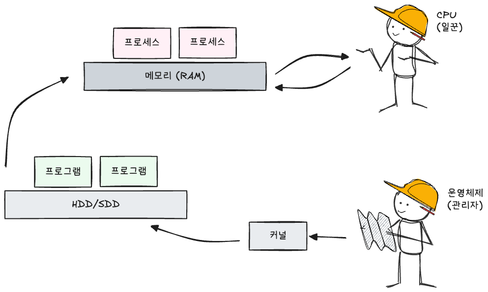

> [스터디](https://commonsite.notion.site/CS-372cc204d2648052884cc97488265e59)를 함께 진행했음

## 운영체제의 역할과 구조

### 운영체제의 역할

- CPU 스케줄링과 프로세스 관리
- 메모리 관리
- 디스크 파일 관리
- I/O 디바이스 관리

### 운영체제의 구조

- GUI는 없을 수도 있다.
- 커널 : 운영체제의 핵심 부분으로, 하드웨어 자원을 관리하고 프로세스·메모리·파일 시스템·I/O 요청을 제어한다.
- 드라이버 : 하드웨어를 제어하기 위한 소프트웨어

------

**시스템 콜** : 사용자 프로그램이 운영 체제의 커널 기능을 요청하기 위한 인터페이스

유저 프로그램이 I/O 요청을 위해 시스템 콜을 호출하면 트랩이 발생하고, 운영체제가 올바른 요청인지 확인한 뒤 커널 모드로 전환되어 I/O 작업을 수행한다.

- 유저 모드 : 유저가 접근할 수 있는 영역. 유저 프로그램의 로직이 수행된다.
- 커널 모드 : 모든 컴퓨터 자원에 접근할 수 있는 모드. 파일을 읽는 것은 커널 모드에서 수행된다.

이런 분리를 통해서 유저 프로그램이 컴퓨터 자원에 직접 접근하는 것을 차단하고, 프로그램들 사이에 보호를 할 수 있다.

프로세스나 스레드에서 운영체제에 어떤 요청을 할 때 시스템 콜과 커널을 거쳐서 그 요청이 운영체제에 전달된다. 이런 면에서 시스템 콜은 추상화 계층이라고 할 수 있다.

------

**`modebit`** : CPU가 현재 실행 모드가 유저 모드인지 커널 모드인지 구분하기 위한 플래그.

`modebit`가 0이면 커널 모드, 1이면 유저 모드를 의미한다.

유저 모드에서는 컴퓨터 자원에 직접 접근할 수 없다. 대신 시스템 콜을 호출하면 트랩이 발생하고, 운영체제가 요청을 검증한 뒤 `modebit`를 0으로 바꿔 커널 모드에서 작업을 수행한다. 작업이 끝나면 다시 `modebit`를 1로 바꾸고 유저 모드로 돌아간다.

## 컴퓨터의 요소

### CPU

CPU는 메모리에 존재하는 명령어를 해석해서 실행하는 장치. 일꾼이다.

관리자 역할을 하는 운영체제의 커널이 프로그램을 메모리에 올려서 프로세스로 만들면, CPU가 이걸 실행한다.

CPU는 제어장치, 레지스터, 산술논리연산장치로 구성되어 있다.

------

**제어장치(Control Unit)** : 명령어를 읽고 해석하며, CPU 내부와 I/O 장치 간의 데이터 흐름을 제어하고 데이터 처리 순서를 결정한다.

**레지스터** : CPU가 사용하는 임시 기억장치. CPU와 직접 연결되어 있기 때문에 매우 빠르다. 레지스터를 거쳐서 데이터가 전달된다.

**산술논리연산장치(ALU)** : 덧셈, 뺄셈 같은 산술 연산과 논리합, 논리곱 같은 논리 연산을 수행하는 디지털 회로이다.

------

**CPU의 연산 과정** 예시

1. 제어장치가 메모리에 있는 계산할 값을 레지스터로 로드한다.
2. 제어장치가 레지스터의 값을 연산하라고 ALU에 명령한다.
3. ALU가 연산한 결과를 다시 레지스터에 저장한 뒤, 필요하면 메모리에 저장한다.

------

**인터럽트** : 어떤 신호를 통해서 CPU를 잠깐 정지시키는 것

인터럽트가 발생하면 인터럽트 벡터 테이블을 참조해서 해당 인터럽트 핸들러 함수가 실행된다.

> 인터럽트 벡터 : 인터럽트 핸들러의 주소
>
> 인터럽트 벡터 테이블 : 인터럽트별 핸들러의 주소를 담고 있는 테이블

- 하드웨어 인터럽트 : I/O 디바이스로부터 발생되는 인터럽트
- 소프트웨어 인터럽트 : 트랩이라고도 한다. 시스템 콜을 호출하거나 프로세스 오류가 발생했을 때 발생하는 인터럽트

### DMA 컨트롤러

I/O 디바이스가 메모리에 직접 접근할 수 있게 하는 장치

CPU가 너무 많은 인터럽트를 처리하면 부하가 심해질 수 있기 때문에 CPU의 일을 나눠서 하는 보조 일꾼 역할을 한다.

### 메모리

데이터나 상태, 명령어를 기록하는 장치. 보통 RAM을 메모리라 한다.

CPU가 일꾼이라면 메모리는 작업장이라 할 수 있다. 작업장이 크면 많은 일을 할 수 있듯이, 메모리가 크면 클수록 많은 일을 동시에 할 수 있다.

### 타이머

특정 프로그램에 시간 제한을 다는 역할을 한다.

### 디바이스 컨트롤러

I/O 디바이스들의 작은 CPU를 말한다. 각 디바이스를 제어하고, CPU와 디바이스 사이에서 데이터를 주고받는 역할을 한다.
