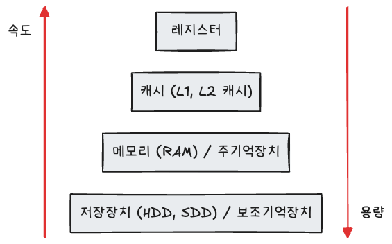
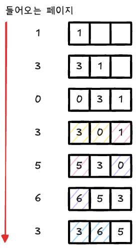

> [스터디](https://commonsite.notion.site/CS-372cc204d2648052884cc97488265e59)를 함께 진행했음

## 메모리 계층



- **레지스터**: CPU 안의 작은 메모리. 휘발성. 속도가 가장 빠르고 용량이 작다.
- **캐시** : L1, L2, L3 캐시를 말함. 휘발성
- **주기억장치** : RAM. 휘발성
- **보조기억장치** : HDD, SSD. 비휘발성. 속도가 느린 대신 용량이 크다.

운영체제는 하드디스크로부터 일정량의 데이터를 RAM에 복사하고, CPU는 RAM에서 필요한 데이터를 빠르게 가져온다.

### 캐시

데이터를 미리 복사해두는 임시저장소

빠른 장치와 느린 장치에서 속도 차이로 인해서 발생하는 병목 현상을 줄이기 위한 메모리이다.

이렇게 속도 차이를 해결하기 위해 계층과 계층사이에 캐싱 계층이 존재한다.

### 지역성

모든 데이터를 캐싱할 수는 없으니 데이터들 중에서 자주 사용하는 데이터를 캐싱하는 것이 합리적일 것이다.

자주 사용하는 데이터를 결정하기 위한 근거로 쓰는 것이 **지역성**이다.

지역성은 공간 지역성과 시간 지역성으로 나뉜다.

- **시간 지역성** : 최근 사용한 데이터에 다시 접근하려는 특성. for 반복문에서 변수 idx에 반복적으로 접근하는 것을 예로 들 수 있다.
- **공간 지역성** : 최근 접근한 데이터를 이루고 있는 공간이나 그 근처에 접근하려는 특성. 배열에 순차적으로 접근하는 상황을 예로 들 수 있다.

### 캐시히트와 캐시미스

**캐시 히트** : 캐시에서 원하는 데이터를 찾은 것

**캐시 미스** : 캐시에 원하는 데이터가 없어 메모리로 가서 데이터를 찾아오는 것

캐시 히트라면 CPU와 가까운 캐시에서 데이터를 가져오기 때문에 빠르지만, 캐시 미스라면 메모리에서 데이터를 가져와야 하므로 상대적으로 느리다.

------

**캐시 매핑** : 메모리의 데이터를 캐시의 어느 위치에 저장할지 정하는 방법.

캐시는 주 메모리에 비해 굉장히 작기 때문에 캐시 계층으로서 역할을 잘 하기 위해서 이 매핑이 중요하다.

- **직접 매핑** : 메모리 블록을 캐시의 정해진 한 위치에만 매핑하는 방법. 위치가 정해져 있어 탐색이 빠르지만, 서로 다른 메모리 블록이 같은 캐시 위치에 매핑되면 충돌이 자주 발생할 수 있다.
- **연관 매핑** : 메모리 블록을 캐시의 어느 위치에든 저장할 수 있는 방법. 저장 위치가 자유로워 충돌이 적지만, 원하는 데이터가 있는지 확인하려면 캐시 전체를 탐색해야 하므로 속도가 느릴 수 있다.
- **집합 연관 매핑** : 캐시를 여러 집합으로 나누고, 메모리 블록은 정해진 집합 안의 여러 위치 중 하나에 저장하는 방법. 직접 매핑보다 충돌이 적고, 연관 매핑보다 탐색 범위가 작아 두 방식의 장점을 절충한 방식이다.

예를 들어 캐시 공간이 4칸이고 메모리 블록 번호가 0, 1, 2, 3, 4, 5라고 하자.

- 직접 매핑 : `메모리 블록 번호 % 캐시 칸 수`로 위치가 정해진다. 예를 들어 0번 블록과 4번 블록은 둘 다 0번 캐시 칸에 저장되므로 충돌이 발생할 수 있다.
- 연관 매핑 : 0번 블록과 4번 블록을 캐시의 아무 칸에나 저장할 수 있다. 충돌은 적지만 데이터를 찾을 때 캐시 전체를 확인해야 한다.
- 집합 연관 매핑 : 캐시를 여러 집합으로 나누고, 각 블록은 정해진 집합 안에서만 자유롭게 저장된다. 예를 들어 0번 블록과 4번 블록이 같은 집합에 속하더라도 그 집합 안에 여러 칸이 있으면 충돌을 줄일 수 있다.

------

**웹 브라우저의 캐시**

- **쿠키** : 만료기한이 있는 키-값 저장소. 4KB까지 데이터를 저장할 수 있다.
- **로컬 스토리지** : 만료기한이 없는 키-값 저장소. 브라우저마다 차이가 있지만 보통 5MB 정도 저장할 수 있고, 웹 브라우저를 닫아도 유지되며 도메인 단위로 저장된다.
- **세션 스토리지** : 탭 단위로 생성되는 키-값 저장소. 5MB까지 저장할 수 있고 탭을 닫을 때 삭제된다.

------

**데이터베이스의 캐싱 계층**

메인 데이터베이스 위에 레디스 데이터베이스 계층을 캐싱 계층으로 둬서 성능을 향상시키기도 한다.

## 메모리 관리

### 가상 메모리

**가상 메모리** : 메모리 관리 기법 중 하나. 실제 메모리 자원을 추상화하는 방식이다.

이렇게 추상화한 메모리 주소를 **가상 주소**라고 하고, 실제 메모리 주소를 **물리 주소**라고 한다.

가상 주소는 **메모리 관리 장치 (MMU)**에 의해 물리 주소로 변환된다.

가상 메모리는 **페이지 테이블**로 관리된다. 페이지 테이블에서는 가상 페이지 번호와 물리 프레임 번호가 매핑되어 있다.

페이지 변환에는 속도 향상을 위한 캐시인 **TLB**를 사용한다. TLB에는 최근 사용한 가상 주소와 물리 주소의 변환 정보가 저장된다.

------

**스와핑** : 사용하지 않는 영역을 RAM에서 내리고 사용하는 영역을 RAM에 올리는 것을 말한다.

가상 메모리에는 존재하지만 실제 메모리(RAM)에는 없는 영역에 접근하면 페이지 폴트가 발생하고, 이때 필요한 페이지를 RAM에 올리는 과정에서 스와핑이 일어난다.

------

**페이지 폴트(Page Fault)** : 프로세스의 주소공간에는 존재하지만 RAM에는 없는 데이터에 접근했을 때 발생한다.

페이지 폴트가 발생하면 운영체제가 해당 데이터를 메모리로 가져온다.

------

**페이지 폴트와 스와핑의 과정**

1. CPU가 페이지 테이블을 확인했을 때 해당 페이지가 RAM에 없으면 페이지 폴트가 발생한다.
2. 운영체제는 CPU 동작을 잠시 멈춘다.
3. 운영체제가 페이지 테이블을 통해 해당 접근이 유효한지 확인한다.
   - 유효하지 않은 접근이면 프로세스를 중단한다.
   - 유효한 접근이면 물리 메모리에 비어 있는 프레임이 있는지 찾는다.
4. 비어 있는 프레임이 없으면 페이지 교체 알고리즘으로 기존 페이지를 스왑 아웃한다.
5. 필요한 페이지를 RAM에 로드하고 페이지 테이블을 갱신한다.
6. 중단되었던 작업을 다시 시작한다.

> **페이지** : 가상 메모리를 사용하는 최소 크기 단위

> **프레임** : 실제 메모리를 사용하는 최소 크기 단위

### 스레싱

**스레싱** : 페이지 폴트가 지나치게 자주 발생해 실제 작업보다 페이지 교체에 더 많은 시간을 쓰는 상태를 말한다.

메모리에 너무 많은 프로세스가 동시에 올라갔을 때 스와핑이 너무 많이 일어나면서 스레싱이 발생한다.

```
페이지 폴트
↓
CPU 이용률 ↓
↓
운영체제가 CPU 이용률을 높이기 위해 더 많은 프로세스를 로드
↓
페이지 폴트
↓
...
```

**해결 방법**

- 물리적 해결 : 메모리를 늘리거나 HDD에서 SSD로 바꾼다.
- 운영체제가 하는 해결 : 작업 세트, PFF

------

**작업 세트** : 지역성을 통해 결정된 페이지 집합을 만들어서 메모리에 미리 로드하는 방법

**PFF(Page Fault Frequency)** : 페이지 폴트 빈도의 상한선과 하한선을 만드는 방법. 상한에 도달하면 페이지를 늘리고, 하한에 도달하면 페이지를 줄이는 식으로 동작한다.

### 메모리 할당

메모리에 프로그램을 할당할 때는 시작 메모리 위치, 메모리의 할당 크기를 기반으로 한다.

------

**연속 할당**

메모리에 연속적으로 공간을 할당한다. 프로세스의 순서대로 공간을 할당하는 것.

- 고정 분할 방식(fixed partition allocation) : 메모리를 미리 나누어 관리하는 방식. 메모리가 미리 나뉘어 있기 때문에 융통성이 없고, 내부 단편화가 발생한다.
- 가변 분할 방식(variable partition allocation) : 매 시점 프로그램의 크기에 맞게 동적으로 메모리를 나눠서 사용하는 방식. 내부 단편화는 발생하지 않지만 외부 단편화가 발생할 수 있다.
  - 최초적합(first fit) : 가장 먼저 발견한 홀에 할당함
  - 최적적합(best fit) : 할당할 수 있는 홀 중에 가장 작은 홀부터 할당
  - 최악적합(worst fit) : 할당할 수 있는 홀 중에 가장 큰 홀부터 할당. 큰 홀을 쪼개면 남은 공간도 여전히 쓸 만할 것이라는 전략이다.

> 내부 단편화(internal fragmentation) : 할당된 메모리 내부에서 실제로 쓰이지 않고 남는 공간이 발생하는 현상
>
> 예를 들어 100MB 공간을 할당했지만 프로그램이 80MB만 사용하면 20MB가 내부 단편화가 된다.

> 외부 단편화(external fragmentation) : 전체 여유 공간은 충분하지만 연속된 큰 공간이 없어 할당하지 못하는 현상
>
> 예를 들어 10MB, 20MB, 30MB의 빈 공간이 흩어져 있으면 전체 여유 공간은 60MB지만, 40MB 프로그램은 연속된 공간이 없어 할당하지 못할 수 있다.

> 홀(hole) : 할당할 수 있는 비어 있는 메모리 공간

------

**불연속 할당**

메모리를 연속적으로 할당하지 않는 방식. 현대 운영체제들이 사용하는 방식이다.

- **페이징(paging)**
  - 메모리를 동일한 크기의 페이지 단위로 나눠서 서로 다른 위치에 프로세스를 할당
  - 홀의 크기가 균일하지 않은 문제는 해결
  - 주소 변환이 복잡해진다는 단점
- **세그멘테이션(segmentation)**
  - 페이지 단위가 아닌 의미 단위인 세그먼트(segment)로 나누는 방식
  - 단순히 용량 단위가 아니라 코드, 데이터, 스택, 힙 같은 의미 단위 또는 함수 단위로 나누는 것이다.
  - 공유와 보안 측면에서 좋다.
  - 홀 크기가 균일하지 않다는 문제가 있다.
- **페이지드 세그멘테이션(paged segmentation)**
  - 프로그램을 의미 단위의 세그먼트로 나누고, 각 세그먼트를 다시 페이지 단위로 나누는 방식
  - 세그먼트 단위로 공유와 보안을 관리할 수 있다.
  - 물리 메모리는 페이지 단위로 관리해 외부 단편화 문제를 줄일 수 있다.

### 페이지 교체 알고리즘

스와핑을 하면서 페이지를 교체하는데 최대한 스와핑이 더 발생하지 않도록 페이지를 교체하는 것이 중요하다. 어떤 페이지를 교체할지 결정하기 위한 페이지 알고리즘들이 여러 개 있다.

------

**오프라인 알고리즘 (offline algorithm)**

앞으로 가장 오랫동안 사용되지 않을 페이지를 교체하는 알고리즘. 그런데 미래에 사용되는 페이지를 알 수 없으므로 실제로는 쓸 수 없는 알고리즘이다. 하지만 가장 이상적인 알고리즘이기 때문에 다른 알고리즘과의 성능 비교를 위해서 쓰인다.

------

**FIFO (First In First Out)**

가장 먼저 온 페이지를 교체 영역에 가장 먼저 놓는 방법

------

**LRU (Least Recently Used)**

참조가 가장 오래된 페이지를 바꾼다.

‘오래된’ 것을 파악하기 위해 각 페이지마다 계수기를 두고, 스택을 둬야 하는 번거로움이 있다.



------

**NUR (Not Used Recently) / NRU(Not Recently Used)**

LRU에서 발전한 알고리즘. 일명 clock 알고리즘이라고 한다.

최근에 참조되었음을 의미하는 1과 최근에 참조되지 않았음을 의미하는 0을 가진 비트를 두고, 시계 방향으로 돌면서 참조 비트가 1이면 0으로 바꾸고 지나간다. 참조 비트가 0인 페이지를 찾으면 해당 페이지를 교체한다.

------

**LFU (Least Frequently Used)**

가장 참조 횟수가 적은 페이지를 교체하는 알고리즘
