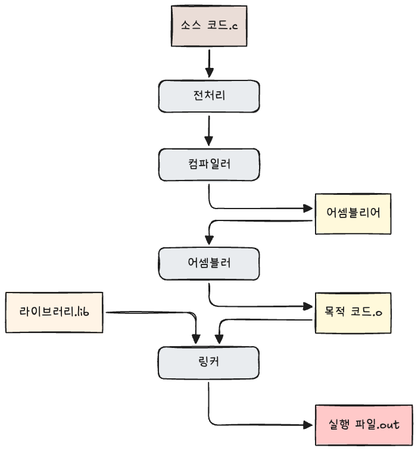
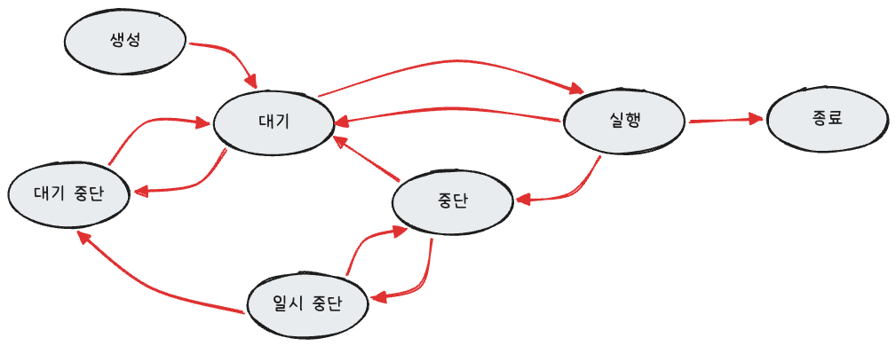
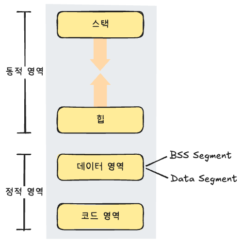
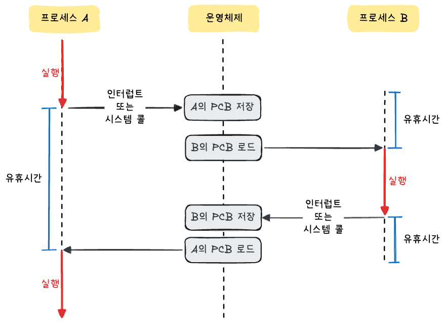

> [스터디](https://commonsite.notion.site/CS-372cc204d2648052884cc97488265e59)를 함께 진행했음

프로세스(process) : 컴퓨터에서 실행되고 있는 프로그램. CPU 스케줄링의 대상이며, 작업(task)과 거의 동일한 의미로 쓰인다.

스레드(thread) : 프로세스 내에서 실행되는 작업 흐름의 단위

프로그램이 메모리에 올라가면 프로세스가 되고(인스턴스화), 운영체제의 CPU 스케줄러에 따라 CPU가 프로세스의 작업을 실행한다.

## 프로세스와 컴파일 과정

컴파일 과정이란 소스 코드 파일이 실행 가능한 파일이 되는 과정을 말한다.

아래에서 설명하는 컴파일 과정은 C 언어 기반의 컴파일 과정을 다룬다.

**전처리**

- 소스 코드의 주석을 제거
- 헤더 파일을 병합
- 매크로를 치환

**컴파일러**

- 오류 검사, 코드 최적화 작업 수행
- 어셈블리어로 변환

**어셈블러**

어셈블리어를 목적 코드(object code)로 변환한다.

**링커**

프로그램 내의 라이브러리 함수와 목적 코드 등 필요한 파일들을 연결해서 실행 파일을 만든다.

- 정적 라이브러리 : 빌드 시에 라이브러리가 제공하는 모든 코드를 실행 파일에 넣는 방식. 외부 의존도가 낮은 장점이 있지만 코드 중복이 생길 수 있어 메모리 효율성이 떨어지는 단점이 있다.
- 동적 라이브러리 : 프로그램 실행 시에 필요할 때 동적 라이브러리 또는 공유 라이브러리를 참조하는 방식. 메모리 효율성에 장점이 있지만, 실행할 때 외부 파일을 참조하기 때문에 외부 의존도가 높다는 단점이 있다.

## 프로세스의 상태

**생성 상태**

프로세스가 생성된 상태. 이때 PCB가 할당된다.

- `fork()` : 부모 프로세스의 주소 공간을 그대로 복사하고 새로운 자식 프로세스를 생성하는 함수
- `exec()` : 현재 프로세스의 주소 공간을 새로운 프로그램으로 덮어씌우는 함수

**대기 상태**

CPU 스케줄러로부터 CPU 소유권이 넘어오기를 기다리는 상태

**대기 중단 상태**

대기 상태인 프로세스가 메모리 부족으로 일시적으로 메모리 밖으로 쫓겨난 상태

**실행 상태**

CPU 소유권을 할당받아 인스트럭션을 수행 중인 상태. CPU burst가 일어났다고도 한다.

**중단 상태**

어떤 이벤트가 발생하기를 기다리며 프로세스가 차단된 상태.

I/O 작업을 요청하면 중단 상태가 되고, I/O 작업이 완료되면 다시 대기 상태로 이동한다.

**일시 중단 상태**

중단 상태인 프로세스가 메모리 부족 등으로 일시적으로 메모리 밖으로 쫓겨난 상태

**종료 상태**

메모리와 CPU 소유권을 모두 반납한 상태.

자연스럽게 종료되는 경우도 있고, 부모 프로세스가 자식 프로세스를 강제적으로 종료하는 경우도 있다.

## 프로세스의 메모리 구조

**스택**

지역 변수, 매개변수, 함수 호출 정보가 저장되는 영역. 함수 호출과 반환에 따라 런타임에 크기가 변하는 동적인 특징을 갖는다.

**힙**

동적으로 할당된 데이터가 저장되는 영역. 런타임 시에 크기가 결정되며, 스택과 마찬가지로 동적인 특징을 갖는다.

**데이터 영역**

전역 변수, 정적 변수가 저장되는 정적인 특징을 갖는 영역이다.

BSS 영역과 Data 영역으로 나뉘는데, BSS 영역에는 초기화되지 않았거나 0으로 초기화된 전역 변수와 정적 변수가 저장되고, Data 영역에는 0이 아닌 값으로 초기화된 전역 변수와 정적 변수가 저장된다.

**코드 영역**

프로그램의 실행 가능한 명령어가 저장되는 영역. 수정 불가능한 기계어로 저장되어 있어 정적인 특징을 갖는다.

## PCB

PCB(Process Control Block) : 운영체제가 프로세스를 관리하기 위해 프로세스에 대한 메타데이터를 저장하는 블록

프로세스가 생성되면 운영체제는 해당 프로세스에 대한 PCB를 생성한다.

### PCB의 구조

- **프로세스 스케줄링 상태** : 생성, 대기, 실행, 중단, 종료 등 프로세스의 현재 상태
- **프로세스 ID** : 프로세스를 식별하기 위한 고유한 ID
- **프로세스 권한** : 프로세스가 접근할 수 있는 자원이나 권한 정보
- **프로그램 카운터** : 다음에 실행할 명령어의 주소를 저장하는 레지스터
- **CPU 레지스터** : 컨텍스트 스위칭 시 저장해야 하는 CPU 레지스터 값
- **CPU 스케줄링 정보** : 프로세스 우선순위, 스케줄링 큐 포인터 등 스케줄링에 필요한 정보
- **계정 정보** : CPU 사용 시간, 실행 시간, 사용자 정보 등 자원 사용 통계
- **I/O 상태 정보** : 프로세스에 할당된 I/O 장치와 열린 파일 정보

### 컨텍스트 스위칭

컨텍스트 스위칭(context switching) : 실행 중인 프로세스를 바꾸는 과정에서 현재 프로세스의 실행 문맥을 PCB에 저장하고, 다음 프로세스의 실행 문맥을 PCB에서 복원하는 과정이다. 한 프로세스에 할당된 시간이 끝나거나 인터럽트가 발생했을 때 일어난다.

**컨텍스트 스위칭에 발생하는 비용**

- **유휴 시간(idle time)** : 컨텍스트 스위칭 동안 CPU가 실제 작업을 수행하지 못하는 시간
- **캐시 미스** : 프로세스가 바뀌면서 기존 캐시 데이터가 새 프로세스에 맞지 않아 캐시 효율이 떨어지는 현상

------

스레드에서도 컨텍스트 스위칭이 일어난다. 같은 프로세스의 스레드들은 코드, 데이터, 힙 영역을 공유하고 각자 스택과 레지스터를 가지기 때문에 프로세스 컨텍스트 스위칭보다 비용이 적다.

## 멀티프로세싱

멀티프로세싱은 여러 프로세스를 사용해 여러 작업을 동시에 처리하는 방식이다. 각 프로세스가 독립된 메모리 공간에서 실행되기 때문에 하나의 프로세스에 문제가 생겨도 다른 프로세스에 영향을 덜 준다는 장점이 있다.

### 웹 브라우저

- **브라우저 프로세스** : 주소 표시줄, 북마크, 뒤로/앞으로 가기 버튼 등 애플리케이션의 창과 UI를 제어하며, 네트워크 요청과 파일 접근을 관리한다.
- **렌더러 프로세스** : 탭(Tab) 내부에서 동작하며, 서버로부터 전달받은 HTML, CSS, JavaScript 코드를 해석하고 사용자가 눈으로 보고 상호작용할 수 있는 화면으로 그려내는 역할을 담당한다.
- **플러그인 프로세스** : 웹 사이트에서 사용하는 플러그인을 제어한다.
- **GPU 프로세스** : GPU를 이용해서 화면을 그리는 부분을 담당한다.

### IPC

IPC(Inter-Process Communication) : 프로세스끼리 데이터를 주고받기 위한 통신 메커니즘

IPC는 메모리를 공유하는 스레드 간 통신보다는 속도가 느릴 수 있다. 프로세스 간 메모리 공간이 분리되어 있어 커널을 거치거나 별도의 통신 수단을 사용해야 하기 때문이다.

------

**공유 메모리**

프로세스가 서로 통신할 수 있도록 공유 버퍼를 이용하는 방법이다. 여러 프로세스에 동일한 메모리 블록에 대한 접근 권한을 부여한다.

어떤 매개체를 통해서 데이터를 주고받는 게 아니라 메모리 자체를 공유하기 때문에 IPC 방법들 중 가장 빠르지만, 같은 메모리 영역을 여러 프로세스가 공유하기 때문에 동기화가 필요하다.

------

**파일**

공유 메모리와 비슷하게 디스크에 저장된 데이터 또는 파일 서버에서 제공하는 데이터를 기반으로 통신하는 방법이다. 여러 프로세스가 같은 파일을 읽고 쓰며 통신하므로 동기화와 파일 잠금이 필요할 수 있다.

------

**소켓**

네트워크를 통해 서로 다른 프로세스가 데이터를 주고받는 IPC 방식이다.

같은 컴퓨터 안의 프로세스뿐 아니라, 서로 다른 컴퓨터의 프로세스끼리도 통신할 수 있다. TCP, UDP 같은 프로토콜을 기반으로 통신하며, 클라이언트-서버 구조에서 자주 사용된다.

------

**익명 파이프**

한쪽 프로세스는 쓰기만 하고 다른 쪽 프로세스는 읽기만 하는 단방향 통신 방식이다.

부모-자식 프로세스 사이에서만 사용할 수 있다.

------

**명명된 파이프**

이름을 가진 파이프를 만들어 서로 관련 없는 프로세스끼리도 통신할 수 있게 하는 방식이다.

익명 파이프는 주로 부모-자식 프로세스 사이에서 사용되지만, 명명된 파이프는 이름을 통해 접근할 수 있기 때문에 독립적인 프로세스 간 통신에도 사용할 수 있다.

------

**메시지 큐**

메시지 큐는 메시지를 큐 형태로 저장하고, 프로세스들이 큐에 메시지를 넣거나 꺼내면서 통신하는 방식이다. 커널이 큐를 관리하기 때문에 메시지 단위로 데이터를 안전하게 주고받을 수 있다.

공유 메모리처럼 직접 동기화를 관리하는 부담이 적고, 사용 방법이 직관적이고 간단하다는 장점이 있다.

## 스레드와 멀티스레딩

### 스레드

스레드 : 프로세스 내에서 실행되는 흐름의 단위. CPU 스케줄링의 기본 단위이며, 하나의 프로세스는 여러 스레드를 가질 수 있다.

스레드는 같은 프로세스의 다른 스레드들과 코드, 데이터, 힙 공간을 공유하고, 스택과 레지스터는 각자 가진다.

### 멀티스레딩

멀티스레딩 : 프로세스의 작업을 여러 개의 스레드로 처리하는 방식을 말한다.

스레드끼리는 코드, 데이터, 힙 영역을 공유하기 때문에 스레드 간 통신 비용이 적고, 컨텍스트 스위칭 비용도 프로세스보다 작다.

하지만 여러 스레드가 자원을 공유하기 때문에 동기화 문제가 생길 수 있고, 한 스레드에 문제가 생기면 프로세스 전체에 영향을 줄 수 있다는 단점이 있다.

------

**멀티스레드의 예 : 렌더러 프로세스**

- 메인 스레드 : HTML, CSS, JavaScript를 처리하고 DOM 생성, 스타일 계산, 레이아웃 작업을 담당한다.
- 워커 스레드 : 메인 스레드와 별도로 JavaScript 작업을 백그라운드에서 처리한다.
- 컴포지터 스레드 : 화면을 여러 레이어로 나누고 합성해 최종 화면을 구성한다.
- 래스터 스레드 : 레이어를 픽셀로 변환해 화면에 그릴 수 있는 비트맵으로 만든다.

렌더러 프로세스는 이런 여러 스레드를 사용해 화면 렌더링 작업을 나누어 처리한다.

## 공유 자원과 임계 영역

### 공유 자원

- **공유 자원** : 시스템 안에서 각 프로세스, 스레드가 함께 접근할 수 있는 자원이나 변수
- **경쟁 상태(race condition)** : 여러 프로세스나 스레드가 공유 자원에 동시에 접근할 때, 접근 순서나 타이밍에 따라 실행 결과가 달라질 수 있는 상태

### 임계 영역

**임계 영역(critical section)** : 공유 자원에 접근하는 코드 영역. 여러 프로세스나 스레드가 동시에 실행하면 경쟁 상태가 발생할 수 있다.

임계 영역 문제를 해결하려면 상호 배제, 한정 대기, 융통성(진행) 조건을 만족해야 한다.

- **상호 배제** : 한 프로세스가 임계 영역에 들어갔을 때 다른 프로세스는 들어갈 수 없다.
- **한정 대기** : 특정 프로세스가 영원히 임계 영역에 들어가지 못하면 안 된다.
- **융통성(진행)** : 임계 영역에 아무도 없고 들어가려는 프로세스가 있다면, 임계 영역에 진입할 수 있어야 한다.

------

**뮤텍스(mutex)** : 공유 자원을 사용하기 전에 획득하고, 사용한 후에 해제하는 잠금.

잠김 또는 잠기지 않음의 두 가지 상태만 갖는다.

------

**세마포어(semaphore)** : 공유 자원의 사용 가능 개수를 나타내는 정수 값을 사용해, `wait()`와 `signal()` 함수로 접근을 제어하는 동기화 도구.

- `wait()` : 세마포어 값을 감소시키고, 사용할 수 있는 자원이 없으면 대기하는 함수
- `signal()` : 세마포어 값을 증가시키고, 대기 중인 프로세스나 스레드를 깨우는 함수

프로세스가 공유 자원에 접근하기 전에는 `wait()`를 수행하고, 공유 자원을 해제한 뒤에는 `signal()`을 수행한다.

- **바이너리 세마포어** : 0과 1 두 가지 값만 가질 수 있는 세마포어. 뮤텍스와 구현이 비슷하다.
- **카운팅 세마포어** : 여러 값을 가질 수 있는 세마포어. 여러 자원에 대한 접근을 제어할 수 있다.

뮤텍스는 보통 잠근 스레드가 직접 해제해야 하지만, 세마포어는 신호를 통해 다른 실행 흐름이 자원 사용 가능 여부를 알려줄 수 있다.

------

**모니터(monitor)** : 공유 자원과 그 자원에 접근할 수 있는 인터페이스를 묶어서 한 번에 하나만 접근할 수 있도록 보장하는 방식

모니터는 내부적으로 락과 조건 변수를 사용해 공유 자원 접근을 제어한다.

모니터 큐를 통해서 공유 자원에 대한 작업들을 순차적으로 처리한다.

모니터 방식에서는 상호 배제 조건이 자동으로 만족하지만, 세마포어에서는 상호 배제를 명시적으로 구현해야 한다는 차이점이 있다.

## 교착 상태

교착 상태(deadlock) : 두 개 이상의 프로세스나 스레드가 서로 점유한 자원을 기다리며 더 이상 진행하지 못하는 상태

------

**원인**

교착 상태가 발생하려면 아래 4가지 조건이 모두 만족되어야 한다.

- **상호 배제 (Mutual Exclusion)** : 한 번에 하나의 프로세스만 특정 자원을 사용할 수 있는 조건
- **점유와 대기 (Hold and Wait)** : 자원을 최소한 하나 보유한 상태에서, 다른 프로세스에 할당된 자원을 추가로 얻기 위해 기다리는 조건
- **비선점 (Non-preemption)** : 다른 프로세스에 할당된 자원을 강제로 빼앗을 수 없는 조건
- **순환 대기(환형 대기) (Circular Wait)** : 자원을 기다리는 프로세스 간에 사이클이 형성된 조건 (예: 프로세스 A는 B의 자원을, B는 C의 자원을, C는 A의 자원을 기다림)

**해결 방법**

- **예방 (Prevention)** : 자원을 할당할 때 애초에 위 조건을 모두 만족하지 않도록 설계한다. 조건을 제한하기 때문에 자원 이용률이 낮아질 수 있다.
- **회피 (Avoidance)** : 교착 상태 가능성이 없을 때만 자원을 할당한다. 자원 할당 가능 여부 확인에는 은행원 알고리즘을 주로 사용한다.
- **탐지 및 복구(Detection and Recovery)** : 자원 할당 그래프에서 사이클이 있는지 탐지하고, 관련 프로세스를 종료하거나 자원을 회수해 교착 상태를 해결하는 방법
- **무시 (Ignore)** : 교착 상태는 매우 드물게 일어나므로 이를 탐지하는 데 드는 비용이 더 클 수 있다. 그래서 교착 상태가 일어나게 두고, 사용자가 직접 해결하도록 한다. 현대 운영체제에서 사용하는 방식이다.

예방은 교착 상태 발생 조건 자체를 깨는 방법이고, 회피는 위험한 자원 할당을 피하는 방법이다. 탐지 및 복구는 발생 후 찾아서 해결하는 방법이고, 무시는 별도 처리를 하지 않는 방법이다.

> **은행원 알고리즘** : 총 자원의 양, 현재 할당된 자원의 양, 각 프로세스의 최대 요구량을 바탕으로 안정 상태를 유지할 수 있을 때만 자원을 할당하는 알고리즘
