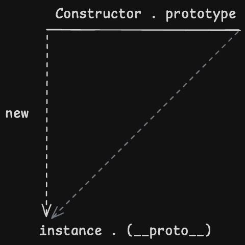
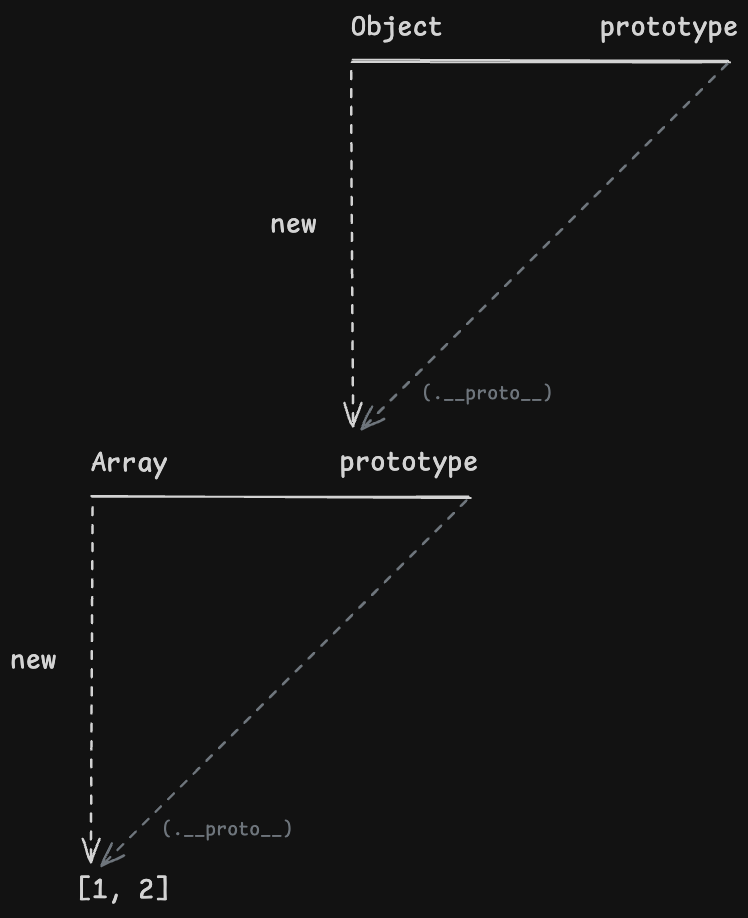

> 자바스크립트를 처음 공부할 때부터 지금까지 이해가 안 되어서 흐린 눈으로 지나가던 프로토타입이 이 챕터를 읽고 단번에 이해됐다…. 저자분이 프로토타입 이해하는 데 일 년 걸렸다고 하셨는데 이렇게 날로 먹어도 되나 황송하기만 하다….

## 프로토타입

자바스크립트는 "프로토타입 기반" 언어이다. 프로토타입 기반 언어에서는 어떤 객체를 프로토타입(원형)으로 삼고 이를 복제(참조)해서 상속과 비슷한 효과를 얻는다.



1. 생성자 함수 (Constructor)를 new 연산자와 함께 생성하면
2. Constructor에 정의된 내용을 기반으로 instance가 만들어진다.
3. 그리고 instance에는 `__proto__` 라는 프로퍼티가 자동으로 부여되는데
4. 이 프로퍼티는 Constructor의 prototype이라는 프로퍼티를 참조한다.

prototype은 인스턴스가 사용할 메서드가 저장된 객체이다. 따라서 `__proto__` 역시 객체이고, 인스턴스에서도 이 프로퍼티를 이용해서 저장된 메서드들에 접근할 수 있다.

> `__proto__` 프로퍼티에 직접 접근할 수 있는 것은 브라우저의 호환성을 고려한 지원일 뿐 권장되는 사항은 아니다. `Object.getPrototypeOf()` 나 `Object.create()` 등을 이용하는 것이 더 좋다.

```javascript
var Person = function (name) {
  this._name = name;
}
Person.prototype.getName = function () {
  return this._name;
}

var daeman = new Person("정대만");
console.log(daeman.__proto__.getName()); // (1) undefined
console.log(daeman.getName()); // (2) "정대만"
```

인스턴스에서는 `__proto__` 를 통해서 메서드에 접근할 수 있기 때문에 (1) 라인에서 오류가 발생하진 않지만, undefined가 출력된다. 이유는 this에 name이 존재하지 않기 때문인데, `daeman.__proto__.getName` 으로 호출한 getName에서의 this는 점 표기법 앞의 `__proto__` 이므로 `__proto__` 가 참조하는 곳에는 name 프로퍼티가 없어 undefined가 출력되는 것이다.

인스턴스를 this로 설정하는 방법은 `__proto__` 를 사용하지 않는 방법이다. 따라서 (2) 라인에서는 this인 daeman의 name인 "정대만"이 잘 출력된다. `__proto__` 는 생략 가능한 프로퍼티로 설계되었기 때문인데, 이는 설계자의 아이디어이기 때문에…. 책에서는 이해의 영역이 아니고 그냥 그렇군. 하고 넘어갈 수밖에 없다고 설명한다.

자바스크립트에서는 함수에 자동으로 prototype이라는 프로퍼티를 만들어 둔다. 이 함수가 만약에 new 연산자와 함께 호출되었을 때, 이로부터 생성된 인스턴스에 숨겨진 프로퍼티인 `__proto__` 를 생성한 다음에, 생성자 함수의 prototype 프로퍼티를 참조하도록 한다. 근데 `__proto__` 프로퍼티는 생략할 수 있도록 설계되어 있기 때문에, 생성자 함수의 prototype에 정의되어 있던 메서드들을 마치 자신의 것처럼 호출할 수 있게 된 것이다.

생성자 함수의 prototype 객체 안의 constructor라는 프로퍼티에는 생성자 함수 (그러니까 자기 자신)를 참조한다. 인스턴스의 `__proto__`에도 (당연하게도) 존재한다. 이 프로퍼티는 인스턴스로부터 그 원형이 무엇인지를 알 수 있는 수단으로 쓰인다.

```javascript
var arr = [1, 2];
Array.prototype.constructor === Array; // true
arr.__proto__.constructor === Array; // true
arr.constructor === Array; // true;
```

이 constructor 프로퍼티는 변경할 수 있기 때문에 안전하지는 않지만 이를 통해서 클래스 상속 비슷한 동작이 가능해진 측면도 있다고 한다. (자세한 내용은 [7장](./7-클래스.md)에서….)

## 프로토타입 체이닝

```javascript
var Person = function (name) {
  this.name = name;
}
Person.prototype.getName = function () {
  return this.name;
}

var daeman = new Person("정대만");
daeman.getName = function() {
  return '불꽃남자 ' + this.name
}

console.log(daeman.getName()); // 불꽃남자 정대만
```

인스턴스와 `__proto__` 에 동일한 이름의 프로퍼티가 있다면, 더 가까운 인스턴스의 프로퍼티를 사용한다. 이렇게 가까운 쪽의 같은 이름을 가진 메서드가 먼 쪽의 메서드를 덮어씌우는 것을 **메서드 오버라이딩**이라고 한다.

오버라이딩 전의 메서드를 호출할 방법이 있긴 하다. this를 잘 지정해주면 `__proto__` 를 통해서 메서드를 호출할 수 있을 것이다.

```javascript
console.log(daeman.__proto__.getName.call(daeman)); // 정대만
```

prototype은 객체이다. 즉 Object의 인스턴스이다. 따라서 prototype 안에도 `__proto__` 프로퍼티가 있다. 아까 삼각형 그림으로 그려보면 이렇게 그릴 수 있다.



이렇게 어떤 데이터의 `__proto__` 프로퍼티 내부에 다시 `__proto__` 프로퍼티가 연결되는 것을 프로토타입 체인이라고 하고, 이 체인을 따라서 메서드를 검색하는 것을 **프로토타입 체이닝**이라고 한다.

> 생성자 함수도 함수이기 때문에 Function 생성자 함수의 prototype과 연결된다. 원래는 위 그림에서 왼쪽으로도 삼각형이 연결되어 있다.

어떤 생성자 함수든 prototype은 반드시 객체이기 때문에 Object.prototype이 프로토타입 체인 최상단에 항상 위치하게 된다. 따라서 어떤 객체든 Object.prototype의 메서드들을 사용할 수 있지만, 문제는 객체만을 대상으로 동작하는 메서드들을 만들 수 없다는 것이었다. 따라서 Object.freeze 같은 객체만을 대상으로 해야 하는 메서드들은 부득이하게 prototype이 아닌 Object의 static 메서드로 부여하게 되었다.

직접 프로토타입 체인을 연결할 수도 있다.

```javascript
// 유사배열객체 Grade
var Grade = function () {
  var args = Array.prototype.slice.call(arguments);
  for (var i = 0; i < args.length; i++) {
    this[i]  = args[i];
  }
  this.length = args.length;
}
Grade.prototype = []; // 배열의 인스턴스를 프로토타입에 연결
var g = new Grade(100, 80);
g.push(90);
console.log(g); // Grade {0: 100, 1: 80, 2: 90, length: 3}
```

> 깨달음을 얻었다…. 삼각형의 힘
